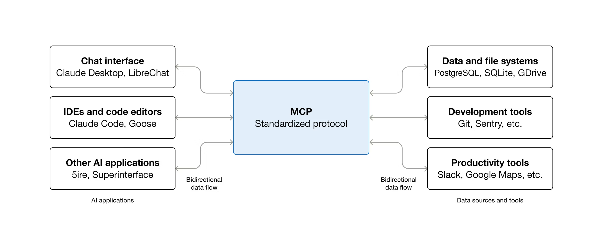

# MCP(Model Context Protocol)

MCP（模型上下文协议）是一种用于将 AI 应用程序连接到外部系统的开源标准。

使用 MCP，Claude 或 ChatGPT 等 AI 应用程序可以连接到数据源（例如本地文件、数据库）、工具（例如搜索引擎、计算器）和工作流程（例如专门的提示），从而使它们能够访问关键信息并执行任务。

可以把 MCP 想象成人工智能应用程序的 USB-C 接口。就像 USB-C 提供了一种标准化的方式来连接电子设备一样，MCP 也提供了一种标准化的方式来将人工智能应用程序与外部系统连接起来。

## MCP 能实现什么？

* agent 可以访问您的 Google 日历和 Notion，充当更加个性化的 AI 助手。
* Claude Code 可以使用 Figma 设计生成整个 Web 应用程序。
* 企业聊天机器人可以连接到组织内的多个数据库，使用户能够通过聊天分析数据。
* AI模型可以在Blender上创建3D设计，并使用3D打印机将其打印出来。

## 为什么 MCP 很重要？

根据您在生态系统中所处的位置，MCP 可以带来一系列好处。

* 开发者：MCP 可缩短构建或集成 AI 应用或代理的开发时间并降低开发复杂性。
* AI 应用或代理：MCP 提供对数据源、工具和应用生态系统的访问，从而增强其功能并改善最终用户体验。
* 最终用户：MCP 可打造功能更强大的 AI 应用或代理，使其能够访问您的数据并在必要时代表您执行操作。

## 架构概述

本文概述了模型上下文协议 (MCP)，讨论了其范围和核心概念，并提供了一个示例来演示每个核心概念。

由于 ``MCP SDK`` 抽象化了许多细节，大多数开发者可能会发现 ``数据层协议(data layer protocol)``部分最为实用。该部分讨论了 MCP 服务器如何为 AI 应用提供上下文信息。

有关具体实现细节，请参阅您所用语言的 ``SDK`` 文档。

### 范围

MCP 包含以下项目：

* MCP 规范：概述客户端和服务器实现要求的 MCP 规范。
* MCP SDK：用于实现 MCP 的不同编程语言的 SDK。
* MCP 开发工具：用于开发 MCP 服务器和客户端的工具，包括 MCP Inspector。
* MCP 参考服务器实现：MCP 服务器的参考实现。

### MCP的概念

#### 参与者

MCP 采用 Client - Server 架构，其中 ``MCP 主机``（例如 ``Claude Code`` 或 ``Claude Desktop`` 等 AI 应用）与一个或多个 ``MCP Server`` 建立连接。``MCP 主机``通过为每个 ``MCP Server`` 创建一个 ``MCP Client`` 来实现这一点。每个 ``MCP Client`` 与其对应的 ``MCP Server`` 保持专用连接。

使用 STDIO 传输的本地 ``MCP Server`` 通常服务于单个 ``MCP Client``，而使用 Streamable HTTP 传输的远程 ``MCP Server`` 通常服务于多个 ``MCP Client``。

MCP 架构的关键参与者包括:

* MCP Host：协调和管理一个或多个 MCP 客户端的 AI 应用程序
* MCP Client：维护与 MCP 服务器的连接并从 MCP 服务器获取上下文信息供 MCP 主机使用的组件
* MCP Server：向 MCP 客户端提供上下文信息的程序

例如：``Visual Studio Code`` 充当 MCP 主机。当 ``Visual Studio Code`` 与 ``MCP 服务器``（例如 Sentry MCP 服务器）建立连接时，``Visual Studio Code`` 运行时会实例化一个 MCP 客户端对象来维护与 Sentry MCP 服务器的连接。随后，当 Visual Studio Code 连接到另一个 MCP 服务器（例如本地文件系统服务器）时，Visual Studio Code 运行时会实例化另一个 MCP 客户端对象来维护此连接。

请注意，``MCP Server`` 指的是提供上下文数据的程序，无论其运行在何处。``MCP Server``可以在本地或远程执行。例如，当 ``Claude Desktop`` 启动文件系统服务器时，该服务器在同一台机器上本地运行，因为它使用 STDIO 传输方式。这通常被称为 “本地” ``MCP Server``。官方的 Sentry MCP 服务器运行在 Sentry 平台上，并使用可流式传输的 HTTP 传输方式。这通常被称为 “远程” ``MCP Server``。

#### Layers

MCP 由两层组成：

* Data Layer(数据层)：定义了基于 JSON-RPC 的客户端-服务器通信协议，包括生命周期管理和核心原语，如工具、资源、提示和通知。
* Transport layer(传输层)：定义了客户端和服务器之间进行数据交换的通信机制和通道，包括特定于传输的连接建立、消息帧和授权。

从概念上讲，数据层是内层，而传输层是外层。

##### 数据层

数据层实现了基于 ``JSON-RPC 2.0`` 的交换协议，该协议定义了消息结构和语义。

该层包括：

* 生命周期管理：处理客户端和服务器之间的连接初始化、功能协商和连接终止。
* 服务器功能：使服务器能够提供核心功能，包括用于 AI 操作的工具、上下文数据资源以及用于客户端交互模板的提示。
* 客户端功能：使服务器能够请求客户端从主机生命周期管理 (LLM) 中采样、获取用户输入以及向客户端记录消息。
* 实用工具功能：支持其他功能，例如实时更新通知和长时间运行操作的进度跟踪。

##### 传输层

传输层管理客户端和服务器之间的通信通道和身份验证。它负责连接建立、消息帧封装以及 MCP 参与者之间的安全通信。

MCP 支持两种传输机制：

* 标准输入/输出 (Stdio) 传输：使用标准输入/输出流在同一台机器上的本地进程之间进行直接进程通信，提供最佳性能且无网络开销。
* 可流式 HTTP 传输：使用 HTTP POST 请求进行客户端到服务器的消息通信，并可选地使用服务器发送事件 (Server-Sent Events) 来实现流式传输功能。此传输机制支持远程服务器通信，并支持包括持有者令牌、API 密钥和自定义标头在内的标准 HTTP 身份验证方法。MCP 建议使用 OAuth 获取身份验证令牌。
* 传输层将通信细节与协议层隔离，从而确保所有传输机制都使用相同的 JSON-RPC 2.0 消息格式。

#### Data Layer Protocol

MCP 的核心部分是定义 MCP 客户端和 MCP 服务器之间的模式和语义。开发人员可能会发现数据层（尤其是基本类型集合）是 MCP 中最有趣的部分。它定义了开发人员如何将上下文从 MCP 服务器共享到 MCP 客户端。

MCP 使用 JSON-RPC 2.0 作为其底层 RPC 协议。客户端和服务器相互发送请求并做出相应的响应。当不需要响应时，可以使用通知。

##### 生命周期

MCP 是一种有状态协议，需要生命周期管理。生命周期管理的目的是协商客户端和服务器双方支持的功能。详细信息请参阅规范，示例展示了初始化序列。

##### 基本元素

MCP 原语是 MCP 中最重要的概念。它们定义了客户端和服务器之间可以相互提供哪些信息。这些原语指定了可以与 AI 应用共享的上下文信息类型以及可以执行的操作范围。

MCP 定义了服务器可以公开的三个核心原语：

* 工具：AI 应用可以调用以执行操作的可执行函数（例如，文件操作、API 调用、数据库查询）
* 资源：为 AI 应用提供上下文信息的数据源（例如，文件内容、数据库记录、API 响应）
* 提示：有助于构建与语言模型交互的可重用模板（例如，系统提示、少样本示例）

每种基本类型都关联着用于发现（*/list）、检索（*/get）以及在某些情况下用于执行（tools/call）的方法。MCP 客户端将使用 */list 方法来发现可用的基本类型。例如，客户端可以先列出所有可用的工具（tools/list），然后再执行它们。这种设计使得列表可以动态更新。

举个具体的例子，考虑一个提供数据库上下文的 MCP 服务器。它可以公开用于查询数据库的工具、包含数据库模式的资源，以及包含与工具交互的少量示例的提示。

有关服务器基本类型的更多详细信息，请参阅服务器概念。

MCP 还定义了客户端可以公开的基本功能。这些基本功能允许 MCP 服务器开发者构建更丰富的交互。

* 采样：允许服务器向客户端的 AI 应用程序请求语言模型补全。当服务器开发者需要访问语言模型，但又希望保持模型独立性，并且不希望在 MCP 服务器中包含语言模型 SDK 时，此功能非常有用。他们可以使用 `sampling/complete` 方法向客户端的 AI 应用程序请求语言模型补全。
* 信息获取：允许服务器向用户请求额外信息。当服务器开发者希望从用户获取更多信息或请求用户确认某个操作时，此功能非常有用。他们可以使用 `elicitation/request` 方法向用户请求额外信息。
* 日志记录：允许服务器向客户端发送日志消息，用于调试和监控。

有关客户端基本功能的更多详细信息，请参阅客户端概念。

除了服务器和客户端原语之外，该协议还提供了一些横切实用原语，用于增强请求的执行方式：

* 任务（实验性）：持久执行包装器，支持对 MCP 请求（例如，耗时计算、工作流自动化、批量处理、多步骤操作）进行延迟结果检索和状态跟踪。

##### 通知

该协议支持实时通知，以实现服务器和客户端之间的动态更新。例如，当服务器的可用工具发生变化时（例如，当新功能可用或现有工具被修改时），服务器可以发送工具更新通知，告知已连接的客户端这些变化。通知以 JSON-RPC 2.0 通知消息的形式发送（无需响应），使 MCP 服务器能够向已连接的客户端提供实时更新。

