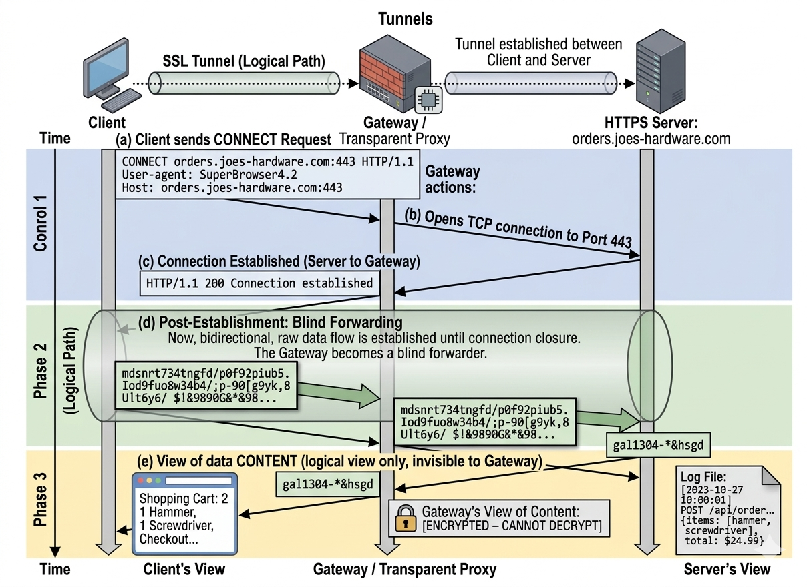

# 隧道

HTTP的另一种用法——Web 隧道(``Web tunnel``), 这种方式可以通过 HTTP应用程序访问使用非HTTP协议的应用程序。

``Web隧道``允许用户通过 HTTP 连接发送非HTTP流量,这样就可以在 HTTP上捎带其他协议数据了。使用 ``Web 隧道`` 最常见的原因就是要在HTTP连接中嵌入非 HTTP流量,这样,这类流量就可以穿过只允许 Web 流量通过的防火墙了。

## 用 CONNECT 建立一条隧道

Web 隧道是用 HTTP 的 CONNECT 方法建立起来的。

**`CONNECT` 方法的本质就是要求代理服务器建立一个透明的 TCP 隧道。**

虽然 `CONNECT` 请求本身是一个 HTTP 协议的命令（属于应用层），但它的唯一目的就是“握手”，一旦握手成功，后续的所有交互就退化到了 **TCP 层（传输层）**。

从以下几个维度来深度理解：

### 1. 协议的“降级”过程
* **第一步（HTTP层）：** 客户端向代理发送一个标准的 HTTP 请求：`CONNECT target.com:443 HTTP/1.1`。
* **第二步（代理操作）：** 代理服务器解析这个请求，提取出目标地址和端口，然后利用自己的网络栈去和目标服务器进行 **TCP 三次握手**。
* **第三步（建立隧道）：** 一旦代理与目标连接成功，它会给客户端回一个 `HTTP 200 Connection Established`。
* **第四步（TCP层）：** 从这一刻起，代理服务器不再解析任何内容。客户端发送的任何数据（无论是 TLS 握手还是普通的二进制流），代理都只是简单地在两个 TCP 连接之间进行**字节转发**。

### 2. 为什么通常用于 TCP 而非 UDP？
由于 `CONNECT` 是基于 HTTP/1.1 规范定义的，而 HTTP/1.1 本身是跑在 TCP 之上的，因此它原生支持的就是 **TCP 隧道**。

* **HTTPS 的基石：** 这是 `CONNECT` 最广泛的应用。因为 HTTPS 需要客户端和服务器直接进行 TLS 握手（交换证书、协商密钥），如果代理服务器去解析这些加密数据，连接就会中断。通过建立 TCP 隧道，TLS 握手就能在隧道内透明地完成。
* **非 Web 协议：** 理论上，你可以通过 `CONNECT` 隧道跑任何基于 TCP 的协议，比如 SSH、Telnet 或 SMTP。

### 3. 特殊情况：HTTP/3 与 UDP

最新的协议发展（比如 QUIC 或 HTTP/3）：

* 传统的 `CONNECT` 确实只针对 TCP。
* 但在 **HTTP/3** 中，由于底层换成了 UDP，社区引入了 **UDP Proxying over HTTP** (RFC 9298)，它允许通过类似的机制来代理 UDP 数据包。

### 总结

在绝大多数开发场景（尤其是做前端开发、配置 Nginx 代理或处理海外 IP 业务）中，你可以认定 **`CONNECT` 就是在拉一条 TCP 管道**。网关在隧道建立后，就像一根普通的“网线”，只负责把 TCP 报文从 A 端搬到 B 端。