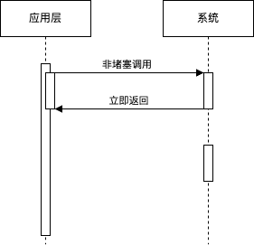
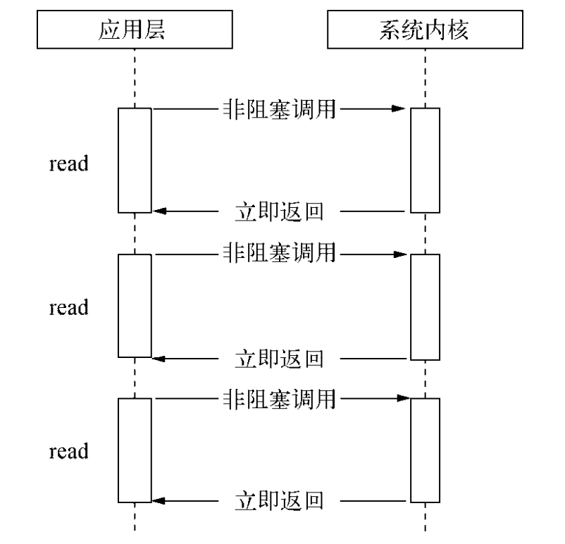
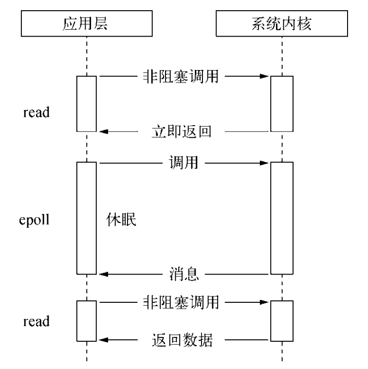

# 异步 IO

## 为什么需要异步 IO

    * 用户体验：浏览器JS引擎（如V8）是单线程的，早期的同步HTTP请求（或表单提交）会阻塞整个事件循环，导致UI线程“假死”（用户无法滚动、点击等）。AJAX（异步JavaScript和XML）的引入正是为了解决这个问题，让I/O操作（如网络请求）在后台进行，而不中断用户交互。这大大提升了Web应用的响应性和流畅度。
    * 资源利用：在单线程模型下，耗时任务（尤其是I/O密集型，如文件读写、网络延迟）会阻塞主线程，导致队列中的其他任务（如渲染、用户事件）延迟执行。这确实造成CPU“空闲等待”的资源低效利用——线程在等I/O时，什么都干不了，CPU利用率低下。

当在实际业务场景下，一组不想关的任务需要完成时，现在主流方法有两种：

* 单线程串行依次执行
    * 单线程顺序执行任务方式符合人们思维方式
    * 串行执行的缺点在于性能，任意一个略慢的任务都会导致后续执行代码别堵塞
    * 在计算机资源中，通常IO与CPU的计算之间是可以并行运行的，由于串行可能会导致资源的利用率不高。
* 多线程并行执行
    * 如果创建多线程的开销小于并行执行，那么多线程的方式是首选的。
    * 多线程的代价在于创建线程和线程执行时切换上下文开销较大。 另外在复杂的业务中，多线程编程经常面临锁、状态同步等问题，这是多线程被诟病的主要原因。但多线程在多核CPU上能够有效提升CPU的利用率，这个优势是毋庸置疑的。

Node 结合两者，给出它的实现方案：利用单线程，远离多线程死锁、状态同步等问题，利用异步IO，让单线程远阻塞，以更好地利用CPU。

## 异步I/O与非阻塞I/O

操作系统内核对于 I/O 只有两种方式：``阻塞``与``非阻塞``。 在调用阻塞I/O时，应用程序需要等待I/O完成才返回结果。

``阻塞 I/O`` 的一个特点是调用之后一定等到系统内核层面完成所有操作后，调用才结束。以读取磁盘文件为例：系统内核在完成磁盘寻道然后读取数据再复制数据到内存中之后，这个调用才结束。

正是因为 ``阻塞 I/O`` 会造成 CPU 利用率降低。为了减少CPU等待时间，提供它利用率，内核提供了非阻塞I/O。 ``非阻塞I/O`` 是调用之后立即返。如下图所示：

``非阻塞I/O`` 返回之后，CPU的时间片可以用来处理其它事物，此时的性能提升是明显的。但非阻塞I/O也存在一些问题。由于完整的I/O并没完成，立即返回的并不是业务层期望的数据，而仅仅是当前调用的状态。为了获得完整的数据，应用程序需要重复调用I/O操作来确认是否完成。这种重复调用判断操作是否完成的技术叫做轮训。

常见的轮训技术：

* read：通过反复检查 I/O 是否就绪来完成数据读取，在数据未准备好之前，CPU 会持续执行检查操作而无法让出执行权，形成忙等，导致 CPU 资源被大量浪费，因此是性能最差的一种方式。

* epoll: Linux 提供的高效 I/O 事件通知机制，通过内核事件驱动避免遍历轮询，在无事件时线程休眠不占用 CPU，有事件发生时立即被唤醒，适合高并发场景。

当处于休眠时，对于当前线程来说 CPU 是闲置的。对于操作系统而言，它可以将CPU调度给别的线程/进程。

