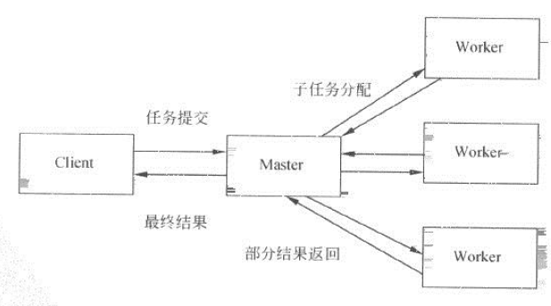

# Master-Worker

``Master-Worker`` 模式是常用的并行设计模式。它的核心思想是，系统有两个进程协议工作：``Master进程``和``Worker进程``。``Master进程``负责接收和分配任务，``Worker进程``负责处理子任务。
当各个 Worker 进程将子任务处理完后，将结果返回给Master进程，由Master进行归纳和汇总，从而得到系统结果。处理过程如下图：

