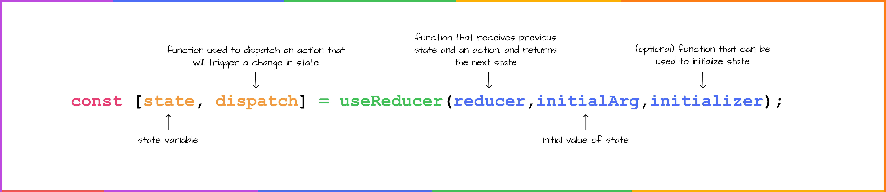

# useReducer

``useReducer`` 钩子类似于 ``useState``，因为它也提供了一种在组件中管理状态更改和更新的方法，但旨在更有效地处理更复杂的状态更改。



现在通过一个示例来理解 ``useReducer``，先定义 ``state`` 和 ``reducer``。

```js
const initialState = { name: "John", age: 30 };

const reducer = (state, action) => {
  switch (action.type) {
    case "updateName":
      return { ...state, name: action.payload };
    case "updateAge":
      return { ...state, age: action.payload };
    default:
      return state;
  }
};
```

接下来，将 ``state`` 和 ``reducer`` 传递给 ``useReducer``。 ``useReducer`` 钩子函数会返回一个数组，数组中包含当前的 ``state`` 和 ``dispatch`` 函数。

```js
import { useReducer } from "react";

const initialState = { name: "John", age: 30 };
const reducer = (state, action) => {
  switch (action.type) {
    case "updateName":
      return { ...state, name: action.payload };
    case "updateAge":
      return { ...state, age: action.payload };
    default:
      return state;
  }
};

const UserForm = () => {
  const [state, dispatch] = useReducer(reducer, initialState);

  return (
    <form>
      <label>
        姓名:
        <input
          type="text"
          value={state.name}
          onChange={(e) =>
            dispatch({ type: "updateName", payload: e.target.value })
          }
        />
      </label>
      <label>
        年龄:
        <input
          type="number"
          value={state.age}
          onChange={(e) =>
            dispatch({ type: "updateAge", payload: e.target.value })
          }
        />
      </label>
    </form>
  );
};
```

## 总结

* ``useReducer`` 与 ``useState`` 类似，前者更侧重处理复杂的 ``state`` 管理。


