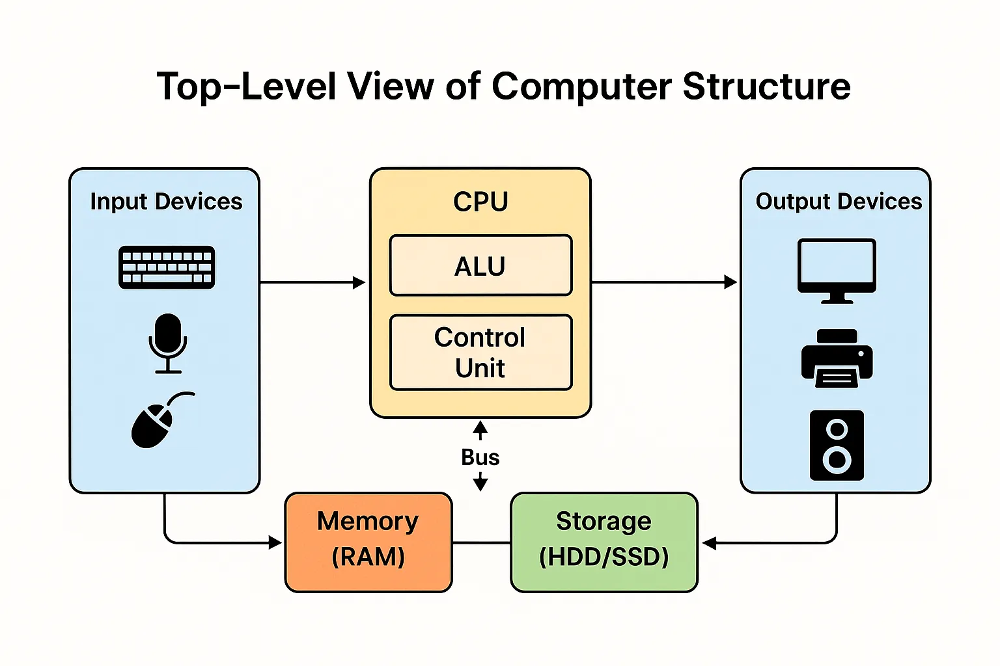
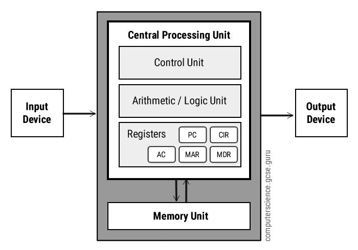
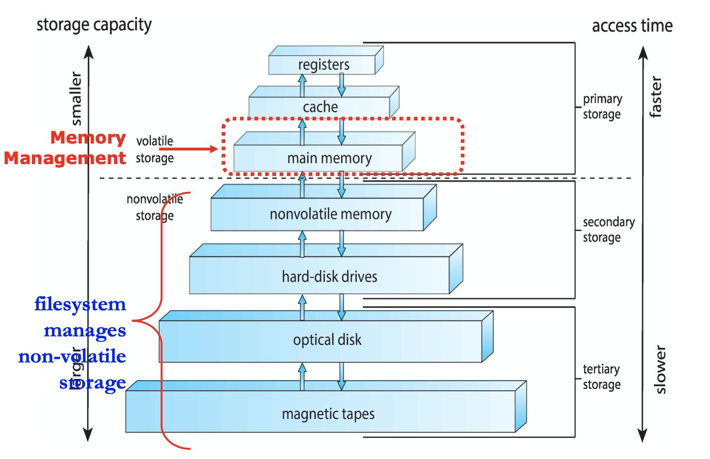
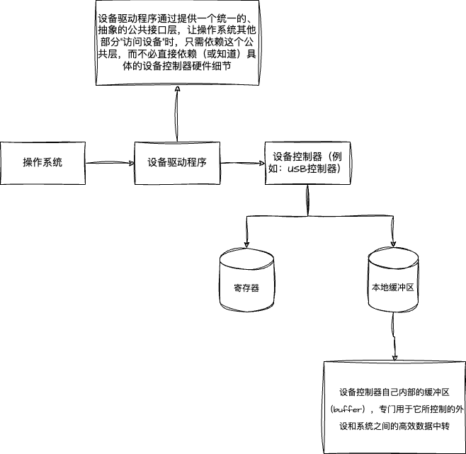

# 计算机四个组件

* ``硬件(hardware)``：如中央处理单元(Central Processing Unit, CPU)、内存(memory)、 输入/输出设备(Input/Output device. I/O device)，为系统提供基本的计算资源
* ``操作系统``：控制硬件，并协调各个用户应用程序的硬件使用。
* ``应用程序``：如字处理程序、电子制表软件、编译器、网络浏览器，规定了用户为解决计算问题而使用这些资源的方式
* ``用户``

计算机系统可以分为``硬件``、``软件``及``数据``。当计算机系统运行时，操作系统提供正确手段以便使用这些资源。 操作系统类似于政府，其本身不能实现任何有用功能，而是提供一个方便其他程序执行有用的工作环境。

计算机系统的根本目的是，执行用户程序并且更容易解决用户问题。为实现这一目的，构造了计算机硬件。由于硬件本身并不十分容易使用，因此开发了应用程序。这些应用程序需要一些共同操作，如控制I/O设备。这些控制和分配I/O设备资源的共同功能则被组成一个软件模块：``操作系统``。

## 二 操作系统

### 2.1 从系统视角理解操作系统

从计算机的角度来看，操作系统是与硬件紧密相连的程序。因此，可将操作系统看作资源分配器(``resource allocator``)。 为了解决问题，计算机系统可能具有许多资源：``CPU时间``、 ``内存空间``、``文件存储空间``、``I/O设备``等。 操作系统管理这些资源。面对许多甚至冲突的资源请求，操作系统应考虑如何为各个程序和用户分配资源，以便计算机系统能有效且公平地运行。正如前面所说，对于多个用户访问主机或微型计算机，资源分配是特别重要的。

### 2.2 操作系统定义

操作系统：是一直运行在计算机上的程序（通常称为``内核(kernel)``）。（除了内核外，还有其他两类程序：系统程序（system program 和应用程序。前者是与系统运行有关的程序，但不是内核的一部分；后者是与系统运行无关的所有其他程序。）

## 三 计算机系统的组成

现在通用计算机系统包括一个或多个 CPU 和 若干设备控制器，通过公用总线相连而成，该总线提供了共享内存的访问。 每个设备控制器负责一类特定的设备(如磁盘驱动
器、音频设备或视频显示器)。CPU与设备控制器可以并发执行，并且竞争访问内存。为了确保有序访问共享内存，需要内存控制器来协调访问内存。

* 设备：键盘、麦克风、鼠标、电脑、打印机、音箱
* 设备控制器：USB控制器、图形适配器等
* 内存

### 3.1 计算机启动流程

当计算机电源打开或重启以便开始运行时，它需要运行一个初始程序。该初始程序或``引导程序 (bootstrap program)`` 通常很简单，一般位于计算机的``固件(firmware)``,如``只读内存(Read-Only Memory, ROM)``或``电可擦可编程只读内存(Electrically Erasable Programmable Read-Only Memory)`` 它初始化系统的各个组件，从``CPU寄存器``、``设备控制器``到``内存``内容。
引导程序必须知道如何加载操作系统并且开始执行系统。为了完成这一目标，引导程序必须定位操作系统内核并且加到内存。

一旦``内核(操作系统)``加到内存并执行，它就开始为系统与用户提供服务。除了内核外，系统程序也提供一些服务，它们在启动时加到内存而成为 ``系统进程(system process)`` 或 ``系统后台程序 (system daemon)`` ,其生命周期与内核一样。对于 UNIX,首个系统进程为"init",它启动许多其他系统的后台程序。一旦这个阶段完成，系统就完全启动了，并且等待事件发生。

事件发生通常通过硬件或软件的``中断(interrupt)``来通知。``硬件``可以随时通过``系统总线发送信号到CPU``,以触发中断。``软件``也可通过执行特别操作即系统调用``(system call)(也称
为监督程序调用(monitor call))``,以触发中断。

### 3.2 存储结构

CPU 只能从内存中加载指令，因此执行程序必须位于内存。通用计算机运行的大多数程序通常位于可读写内存，称为``内存（main memory）``，也称为``随机访问内存(Random Access Memory, RAM)``。内存通常为``动态随机访问内存(Dynamic Random Access Memory, DRAM)``,它采用半导体技术来实现.

#### 3.2.1 ``CPU`` 只能从内存中加载指令

计算机体系结构（特别是冯·诺依曼架构）中的一个核心原则，简单来说，它强调CPU（中央处理器）执行任何程序时，必须先将指令（即程序代码）从主内存（RAM）中读取进来，不能直接从其他地方（如硬盘、U盘）“即时”获取。

CPU 的工作方式：CPU 就像一个“执行工厂”，它通过“取指-译码-执行”（Fetch-Decode-Execute）循环来运行程序。取指（Fetch） 是第一步：CPU 从一个叫“程序计数器”（PC）的寄存器中获取内存地址，然后通过内存总线（Address Bus）向内存请求数据。如果内存返回的是指令（machine code），CPU 就加载它到内部寄存器中执行。

* 为什么只能从内存中？
    * ``内存（RAM）``是 CPU 的“工作台”：它速度快（纳秒级），CPU 可以直接访问。硬盘或外存速度慢（毫秒级），CPU 无法实时读取。
    * 程序运行前，必须通过操作系统（如 Windows 的加载器）将可执行文件（.exe）从硬盘复制到内存中。这就是“加载”（Loading）程序的过程。
    * 如果没有内存，CPU 就“空转”——它不知道要执行什么。

* 为什么不是从硬盘或其他地方直接执行?
    * 速度瓶颈：CPU 每秒可执行数十亿条指令，但硬盘读写太慢。如果 CPU 直接从硬盘取指令，整个系统会卡死（想象一下：每条指令都要等几毫秒）。
    * 架构设计：现代计算机采用“存储器层次结构“：
        * 寄存器（CPU 内部，最快，但容量小，只有几字节）。
        * 缓存（Cache）（CPU 旁边的“快速内存”，从主内存预取数据）。
        * 主内存（RAM）（CPU 的主要指令来源，GB 级容量）。
        * 外存（硬盘/SSD）（持久存储，不直接供 CPU 取指令）。
    * CPU 只能“看到”内存地址空间（虚拟内存），外存数据需先“搬”到内存。

#### 3.2.2 相对完整的存储结构示例图

### 3.3 I/O结构

存储器只是众多计算机 I/O 设备中的一种。操作系统的大部分代码专门用于 I/O 管理，这是由于 I/O 对系统的可靠性和性能至关重要，也是由于不同设备具有不同特性。

通用计算机系统由一个 CPU 和 多个设备控制器组成，它们通过共同总线连在一起。 每个``设备控制器（例如： USB控制器）``管理某一特定类型的设备。根据设备控制器的特性，可以允许多个设备与其相连。

每一个设备控制器维护一定量的``本地缓冲存储``和一组特定用户的``寄存器``。设备控制器负责在所控制的外围设备与本地缓冲存储之间进行数据传递。

通常，操作系统为每个设备控制器提供一个``设备驱动程序(device driver)``。 该设备驱动程序负责设备控制器，并且为操作系统的其他部分提供统一的设备访问接口。

#### 3.3.1 系统与外部设备交互

在开始 ``I/O`` 时，设备驱动程序加载设备控制器的适当寄存器(存储)。相应地，设备控制器检查这些寄存器的内容，以便决定采用什么操作（如：从键盘中读取一个字符）。

控制器开始从设备向本地缓冲区传输数据。一旦完成数据传输，``设备控制器``就会通过终端``通知设备驱动程序``，它已完成了操作。然后，``设备驱动程序``返回控制到``操作系统``。对于读操作、数据或数据指针也会返回；而对于其他操作，设备驱动程序返回状态信息。

* 设备驱动程序往设备控制器寄存器中写内容(下指令)。
* 设备控制器检查这些寄存器内容(获取寄存器中内容，开始干活)。
* 控制器把活干完之后，然后通过``中断``通知设备驱动程序，它已经完成操作。
* 设备驱动程序告诉操作系统。

## 名词概念

* CPU(中央处理单元)
* CPU时间
* 时间片轮转
* 操作系统(内核)
* 固件(Firmware): 如只读内存 (Read-Only Memory, ROM) 或电可擦可编程只读内存 (Electrically Erasable Programmable Read-Only Memory, EEPROM)。
* 系统进程
* 寄存器