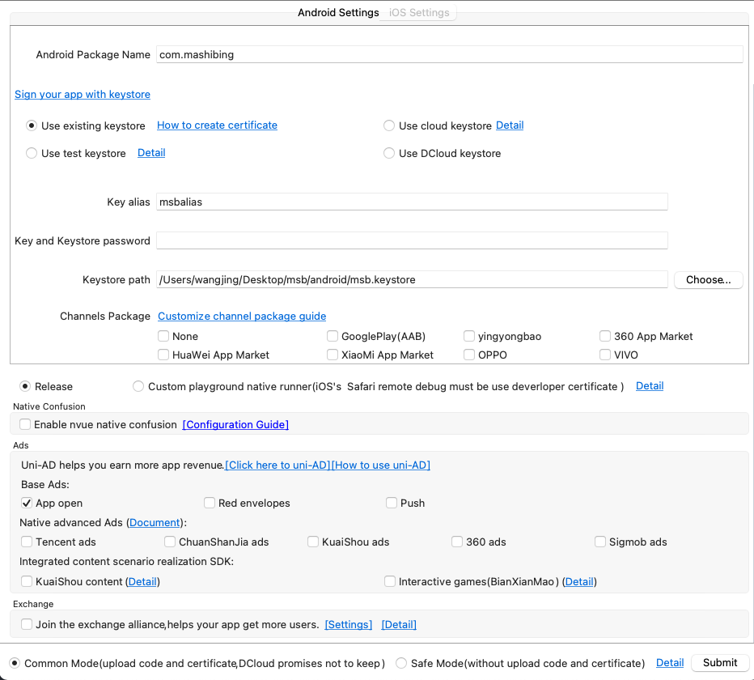

# Android 打包构建

从 HBuilderX 的打包构建可视化界面，来看看我们需要准备哪些东西。

- Android Package Name (安卓包名): 理解为一个包的唯一标识
- keystore (签名)
  - 使用自己生成签名
  - 使用云签名
  - 使用 Test 签名
  - 使用 DCloud 签名
- Verson (版本): 应用版本号
  - Release : 线上版本
  - 自定义 : debugger 版本
- Native Confusion (代码混合)
- Ads 广告
- Mode (模式)
  - Common Mode (上传代码和凭证，DCloud 不会遵循承若)
  - Safe Mode (上传代码和凭证)

签名可以参考上一篇 [keystore](./keystore.md)

## 参考

[uni-app 打包成 Android Apk 详细介绍](https://blog.csdn.net/ygzrsno/article/details/118327722)
