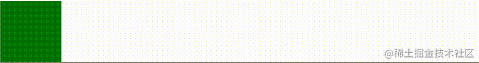
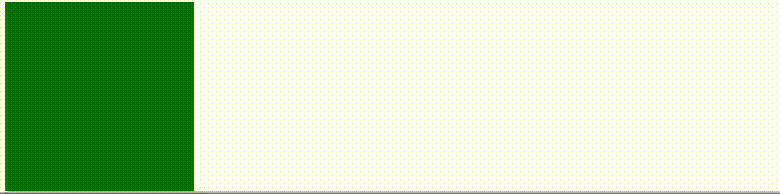
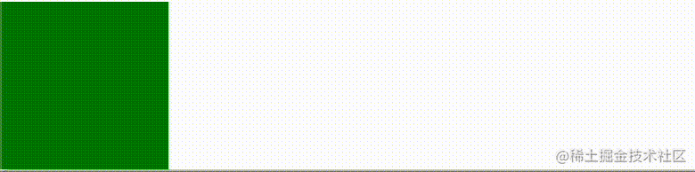
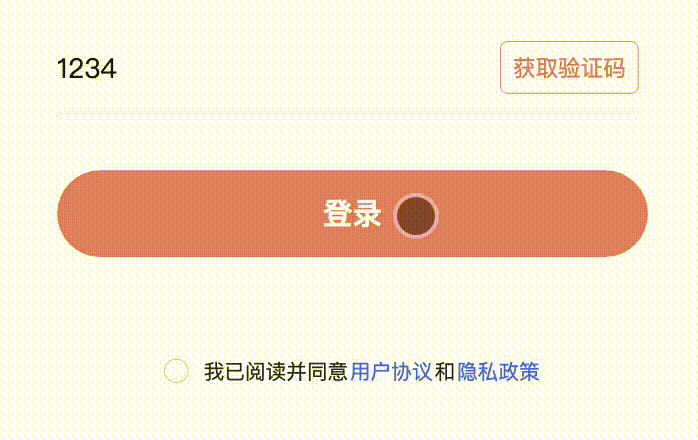
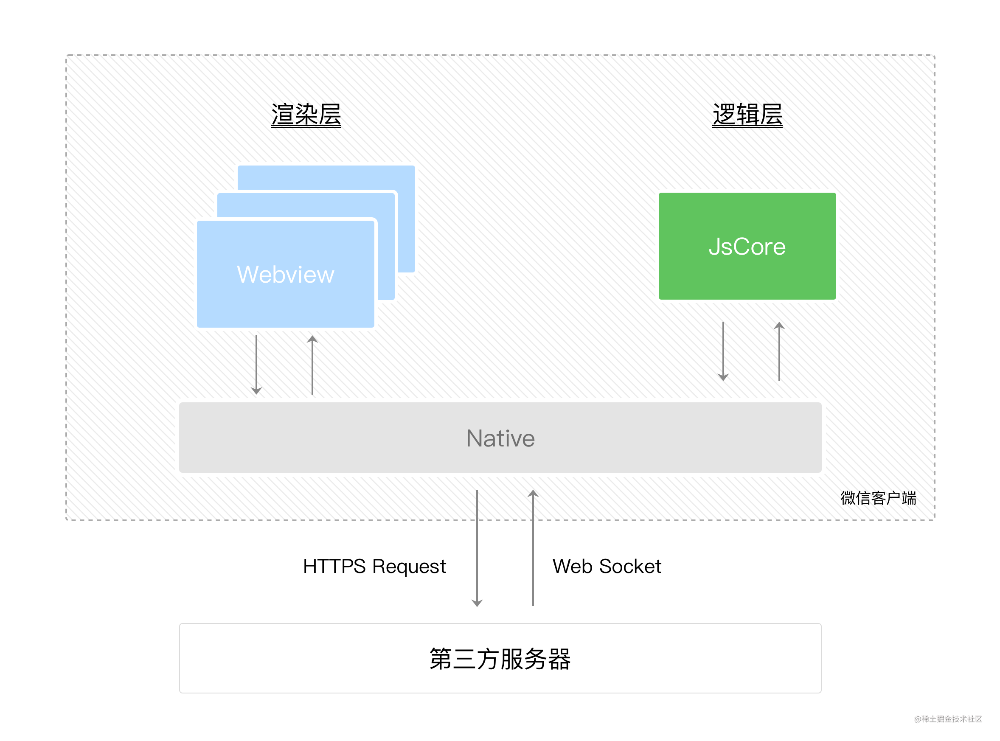

# 定义动画的几种方式

本章的前提就是大家都知道动画的基本属性，例如
`animation-name`、`animation-duration`、`animation-timing-function`、`animation-delay`、`animation-iteration-count`和`animation-direction` 属性。

了解更多 [animation](https://developer.mozilla.org/zh-CN/docs/Web/CSS/animation) 相关的内容。

现在制作一个左右抖动的动画效果，效果如下:


在 uniapp 中，可以通过如下两种方式来完成。

## 1. 直接使用 CSS 动画

### 1.1 定义动画

```css
@keyframes shakeX {
  from,
  to {
    transform: translate3d(0, 0, 0);
  }

  10%,
  30%,
  50%,
  70%,
  90% {
    transform: translate3d(-10px, 0, 0);
  }

  20%,
  40%,
  60%,
  80% {
    transform: translate3d(10px, 0, 0);
  }
}

.shakeX {
  animation-name: shakeX;
  animation-duration: 1s;
}
```

### 1.2 使用

```html
<view class="box shakeX"></view>
<style>
  .box {
    width: 100rpx;
    height: 100rpx;
    background-color: green;
  }
</style>
```

效果如下:



## 2. 通过 uniapp 提供编程式创建动画

uniapp 提供 `createAnimation` 内置函数，用于创建一个动画实例 [animation](https://uniapp.dcloud.net.cn/api/ui/animation.html#animation)。

动画定义步骤:

- 创建动画实例
- 调用实例的方法来描述动画
- 通过动画实例的 `export` 方法导出动画数据
- 导出的动画数据传递给组件的 `animation` 属性(uniapp 提供组件都支持 animation 属性)

兼容性列表:

| App | H5               | 微信小程序 | 支付宝小程序 | 百度小程序 | 字节跳动小程序、飞书小程序 | QQ 小程序 | 快手小程序 | 京东小程序 |
| --- | ---------------- | ---------- | ------------ | ---------- | -------------------------- | --------- | ---------- | ---------- |
| √   | HBuilderX 2.0.4+ | √          | √            | √          | √                          | √         | x          | x          |

> 注意 ⚠️:
>
> - `export`方法每次调用后会清掉之前的动画操作。
> - `nvue` 暂不支持

### 2.1 定义动画

接下来通过编程实现上面抖动功能。

#### 2.1.1 创建动画实例

```js
const animation = uni.createAnimation(); // 定义动画实例
```

#### 2.1.2 调用实例方法来描述动画

在上面的 `shakeX` 动画定义中，通过 `translate3d` 来定义动画。 对应的在 `animation` 实例中去查找与 `translate3d` 相关的实例方法。

`translate` 相关的实例方法，如下:

| 方法        | 参数       | 说明                                                                                               |
| ----------- | ---------- | -------------------------------------------------------------------------------------------------- |
| translate   | tx,[ty]    | 一个参数时，表示在 X 轴偏移 tx，单位 px；两个参数时，表示在 X 轴偏移 tx，在 Y 轴偏移 ty，单位 px。 |
| translateX  | tx         | 在 X 轴偏移 tx，单位 px                                                                            |
| translateY  | ty         | 在 Y 轴偏移 ty，单位 px                                                                            |
| translateZ  | tz         | 在 Z 轴偏移 tz，单位 px                                                                            |
| translate3d | (tx,ty,tz) | 在 X 轴偏移 tx，在 Y 轴偏移 ty，在 Z 轴偏移 tz，单位 px                                            |

有了这些方法之后，我们可以描述动画啦～

```css
@keyframes shakeX {
  from,
  to {
    transform: translate3d(0, 0, 0);
  }

  10%,
  30%,
  50%,
  70%,
  90% {
    transform: translate3d(-10px, 0, 0);
  }

  20%,
  40%,
  60%,
  80% {
    transform: translate3d(10px, 0, 0);
  }
}
```

上面 CSS 中 `translate3d`，对应到编程方式如下:

```js
animation.translate3d(0, 0, 0); // 原始位置
animation.translate3d(-10, 0, 0); // 向左偏移
animation.translate3d(10, 0, 0); // 像右偏移
```

有上面方法后，可以把动画描述出来，如下：

```js
animation
  .animation3d(0, 0, 0) // 0%
  .animation3d(-10, 0, 0) // 10%
  .animation3d(10, 0, 0) // 20%
  .animation3d(-10, 0, 0) // 30%
  // ...
  .animation3d(0, 0, 0); // 100%
```

现在通过 `export()` 方法导出定义动画：

```html
<template>
  <view class="box" :animation="animationData"></view>
</template>
```

```javascript
export default {
  data() {
    return {
      animationData: {},
    };
  },
  onLoad() {
    const animation = uni.createAnimation();
    animation
      .animation3d(0, 0, 0) // 0%
      .animation3d(-10, 0, 0) // 10%
      .animation3d(10, 0, 0) // 20%
      .animation3d(-10, 0, 0) // 30%
      // ...
      .animation3d(0, 0, 0); // 100%
    this.animationData = animation.export();
  },
};
```

代码运行之后，并没有如期出现预期抖动效果。为什么？ 因为 `uniapp` 中在定义的一组动画中是并行执行的，所以并不会产生动画效果。

再回过来，看上面 CSS 中把一个动画周期划分成不同的组(步骤)，`10%` 时执行 `translate3d(-10px, 0, 0)`，`20%` 时执行`translate3d(10px, 0, 0)`。

在 uni-app 中有没有类似的方式呢？ 通过 `step` 来定义。

```js
animation
  .translateX(0) // 0%
  .translateX(10) // 20%
  .step();
animation.translateX(-10).step(); // 30%
animation.translateX(10).step(); // 40%
animation.translateX(-10).step(); // 50%
animation.translateX(10).step(); // 60%
animation.translateX(-10).step(); // 70%
animation.translateX(10).step(); // 80%
animation.translateX(-10).step(); // 90%
animation.translateX(0).step(); // 100%
this.animationData = animation.export();
```

再来执行代码，发现会动了。



从效果来看发现跟预期效果差很多，为什么? 跟 animation 的 `animation-duration` 属性有关。

> `animation-duration`: 属性指定一个动画周期的时长。

也就是一组动画运行完所需时间。 在 `uni.createAnimation()` 创建动画时可以传递参数，在不显示的指定 `duration` 值时，默认值为 `400ms`。 而 `step()` 会继承该值。

| 参数            | 类型    | 必填 | 默认值      | 说明                  |
| --------------- | ------- | ---- | ----------- | --------------------- |
| duration        | Integer | 否   | 400         | 动画持续时间，单位 ms |
| timingFunction  | String  | 否   | "linear"    | 定义动画的效果        |
| delay           | Integer | 否   | 0           | 动画延迟时间，单位 ms |
| transformOrigin | String  | 否   | "50% 50% 0" | 设置 transform-origin |

这就是 “慢” 的原因。

在明白“慢”之后，只要把动画执行时间 (duration) 调整，应该能看到预期效果。假设期望完成抖动时间 `1s`，把动画拆分成 `10` 组，则每一组的动画时间为 `100 ms`.

现在指定 `step` 的 `duration` 值为 `100ms`，更改后代码如下:

```js
animation
  .translateX(0) // 0%
  .translateX(10) // 20%
  .step({
    duration: 100,
  });

animation.translateX(-10).step({
  duration: 100,
}); // 30%

animation.translateX(10).step({
  duration: 100,
}); // 40%

animation.translateX(-10).step({
  duration: 100,
});

// 50%
animation.translateX(10).step({
  duration: 100,
}); // 60%

animation.translateX(-10).step({
  duration: 100,
}); // 70%

animation.translateX(10).step({
  duration: 100,
}); // 80%

animation.translateX(-10).step({
  duration: 100,
}); // 90%

animation.translateX(0).step({
  duration: 100,
});
this.animationData = animation.export();
```

再来执行代码，运行效果如下:



发现效果基本与预期效果一样了。

更多 `uni.createAnimation()` 相关的内容，可以自行查看[文档](https://uniapp.dcloud.net.cn/api/ui/animation.html#createanimation)

## 3. 什么情况下使用编程式创建动画

当不能通过 `css` 方式或通过动态类名一些方式去添加动画时，此时就可以考虑使用编程式来创建动画。编程式可以很灵活创建动画、控制动画运行和监听动画的结束。 其次从`兼容列表`来看，能很好在不同平台运行。

现在看个实际例子: 在登录时，通常需要 ☑️ 选`用户协议和隐私政策` 之后才允许用户登录。现在产品希望当用户在未勾选时点击登录，希望通过`抖动` 用户协议和隐私政策来提醒用户。



上面需求需要完成几个功能点:

- 定义抖动动画类
- 未勾选时动态添加动画类
- 动画结束时移除动画类(用户下一次点击时，需要继续抖动)

通常可以这样做：

```html
<view ref="agreement" class="agreement" :class="{ 'shakeX': actived }">
  <radio
    @click="onChecked"
    style="transform: scale(0.6)"
    :color="color"
    :checked="agreement"
  ></radio>
  我已阅读并同意<text class="service">用户协议</text>和<text class="privacy"
    >隐私政策</text
  >
</view>
<button @click="onLogin">登录</button>
```

```js
export default {
  data() {
    return {
      actived: false, // false
    };
  },
  mounted() {
    this.$refs.agreement.$el.addEventListener('animationend', () => {
      this.actived = false; // 动画结束移除类
    });
  },
  methods: {
    onLogin() {
      // 动态添加
      this.actived = true;
    },
  },
};
```

```css
@keyframes shakeX {
  from,
  to {
    transform: translate3d(0, 0, 0);
  }

  10%,
  30%,
  50%,
  70%,
  90% {
    transform: translate3d(-10px, 0, 0);
  }

  20%,
  40%,
  60%,
  80% {
    transform: translate3d(10px, 0, 0);
  }
}

.shakeX {
  animation-name: shakeX;
  animation-duration: 1s;
}
```

发现在 `app`、`小程序` 上运行时，发现 `this.$refs.agreement.$el ` 为空，这是为什么，这里就是跟 uniapp [底层设计](https://uniapp.dcloud.net.cn/#%E7%9C%8B%E8%A7%86%E9%A2%91-10%E5%88%86%E9%92%9F%E4%BA%86%E8%A7%A3uni-app)有关，如下图所示:



上面引用微信小程序，uniapp 在设计跟小程序是一样的。 也可以在上`底层设计`链接中了解到 `uniapp` 设计。

如果不能获取元素并注册`animationend`事件，没办法很好知道动画结束，不知道何时应该移除。当然有的人想可以通过定时器完成，这样不能精细话控制。

此时通过编程式就可以很好解决兼容的问题，现在稍微调整下:

```html
<view class="agreement" :animation="animationData">
  <radio
    @click="onChecked"
    style="transform: scale(0.6)"
    :color="color"
    :checked="agreement"
  ></radio>
  我已阅读并同意<text class="service">用户协议</text>和<text class="privacy"
    >隐私政策</text
  >
</view>
<button @click="onLogin">登录</button>
```

```js
export default {
  data() {
    return {
      animationData: {},
    };
  },
  onLoad() {
    const animation = uni.createAnimation({
      timingFunction: 'linear',
    });
    this.animation = animation;
  },
  methods: {
    shakeX() {
      const animation = this.animation;
      animation
        .translateX(0) // 0%
        .translateX(10) // 20%
        .step({
          duration: 100,
        });

      animation.translateX(-10).step({
        duration: 100,
      }); // 30%

      animation.translateX(10).step({
        duration: 100,
      }); // 40%

      animation.translateX(-10).step({
        duration: 100,
      });

      // 50%
      animation.translateX(10).step({
        duration: 100,
      }); // 60%

      animation.translateX(-10).step({
        duration: 100,
      }); // 70%

      animation.translateX(10).step({
        duration: 100,
      }); // 80%

      animation.translateX(-10).step({
        duration: 100,
      }); // 90%

      animation.translateX(0).step({
        duration: 100,
      });
      this.animationData = animation.export();
    },
    onLogin() {
      this.shakeX();
    },
  },
};
```

通过编程方式，为什么不需要像动态类名的方式，动画结束必须移除类名否则下次不会生效? 这里留给大家去思考了。

## 4. 总结

- 具体采用哪种方式创建动画，可以根据实际业务场景来定。
- uniapp 编程方式，通过 `step` 来进行动画分组，同一个分组内动画函数会`并行`执行。
- 多个动画分组之间的执行是`串行`的，也就是需等待上一个结束才会执行下一个。
