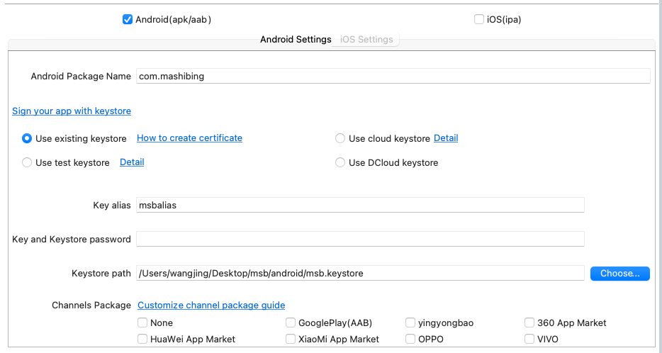
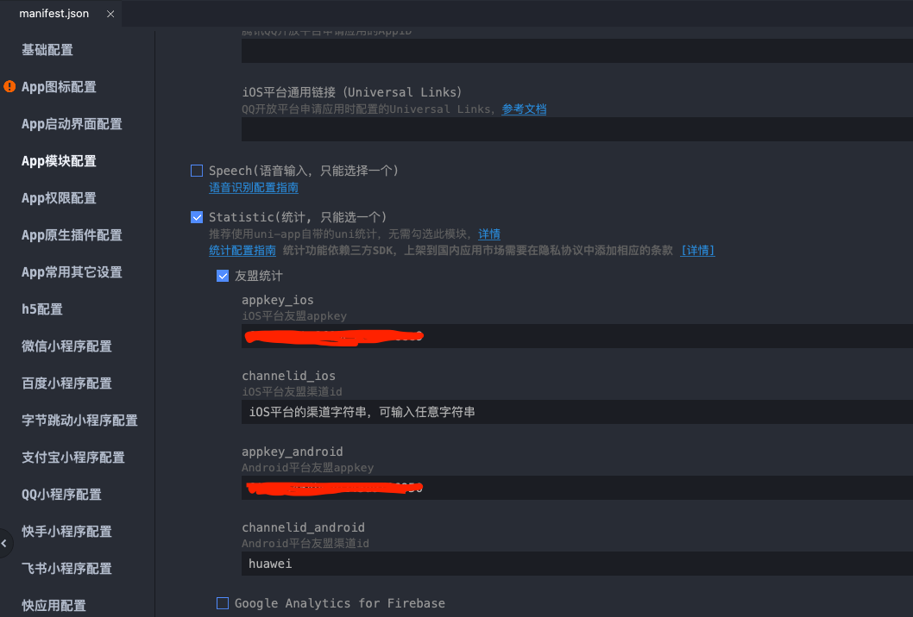

# 构建不同 Channel 包


## 使用 uniapp 内置的

对应 HBuilderX 下，Menu > Build > Cloud Packaging



如上图所示:

HBuilderX 默认提供 7 个渠道（Google、360、小米、华为、应用宝、vivo、oppo），更多可以在manifest.json文件中【源码视图】进行配置。

| 默认渠道      | 渠道标识ID |
| ----------- | ----------- |
| GooglePlay  | google |
| 应用宝   | yyb  |
| 360应用市场   | 360  |
| 华为应用商店   | huawei  |
| 小米应用商店   | xiaomi  |
| vivo应用商店   | vivo    |
| oppo应用商店   | oppo    |

注意：提交谷歌应用市场（Google Play）时一定要将渠道标识设置为google，即一定要选择打包界面里的google渠道，否则会无法提交到play store

## 自定义 Channel 包

默认的渠道数量不够使，想要更多渠道？

在 manifest.json【源码视图】中， 根节点增加 ``channel_list`` 字段.

```json
{
    "channel_list":[
        {
            "id":"",
            "name":""
        }
    ]
}
```

> 注意，``channel_list`` 添加在根节点

比如:

```json
{
    "channel_list":[
        {
            "id":"chuizi",
            "name":"锤子应用市场"
        }，
               {
            "id":"meizu",
            "name":"魅族应用市场"
        }
    ]
}
```

配置后会在上面的云端打包界面显示自定义渠道，提交云端打包时需要勾选才能生效。


## 代码中根据不同渠道添加个性化参数或功能

```js
// 获取渠道 ID
plus.runtime.channel
// 此方法可获取基本的app信息，如版本号，名称等
plus.runtime
```


## 整合 ``umeng`` 对不同的渠道包进行数据分析

默认 ``HbulderX`` 中提供对``友盟SDK``支持，在使用时只需要通过简单的配置即可。

首先打开 ``manifest.json`` 的可视化视图界面，进入 ``App模块配置`` -> ``勾选 Statistic`` -> ``再勾选 友盟统计`` 如下:



从上图中可以看到需要填写项 ``appkey_ios``、``channelid_ios`` 、``appkey_android``、``channelid_android``，其中 ``appkey_ios``、``channelid_android`` 是必填项。 对应的是您在 [友盟后台](https://mobile.umeng.com/platform/apps/list) 申请的应用ID。

``channelid_ios``，``channelid_android`` 可选，属性的作用用于区分来自不同渠道 APP。ios 基本只有一个渠道，android 渠道相应多点，比如``应用宝``、``华为``、``小米``、``viov``、``oppe`` 等。

同样进入可视化视图之后可以看到如下配置内容:

```json
{
    "sdkConfigs":{
        "statics" : {
            "umeng" : {
                "appkey_ios" : "******************",
                "channelid_ios" : "iOS平台的渠道字符串，可输入任意字符串",
                "appkey_android" : "******************",
                "channelid_android" : "huawei"
            }
        }
    }
}
```

集成成功之后，开始进行进入 ``coding`` 阶段，那么在代码中如何进行数据的上报呢 ？ [``plus.statistic``](https://www.html5plus.org/doc/zh_cn/statistic.html)。

```js
plus.statistic.eventTrig("eventName", "事件参数");
```

* eventName: 是在友盟定义的事件名称。
* params: 自定义，需要上报到友盟的数据体。

> ⚠️注意：配置完成后，要用自己的 app 证书等信息，打包自定义调试基座，或者云打包正式 app 后才能生效。


## 注意事项

* uniapp 进行云打包的时候，如果友盟上报需要区分不同渠道，则需要一个一个进行打包。
* uniapp 上报的数据实时性的问题，友盟对于部分数据时性需要是付费用户。 当天上报的可能存在看不到的现象。

## 参考

* [uni-app如何在uni统计后台查看渠道数据](https://tongji.dcloud.net.cn/)
* [云打包如何打渠道包](https://ask.dcloud.net.cn/article/35974)