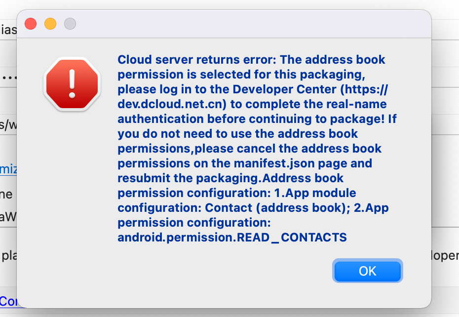

# 常见问题

## 小程序

* [关于小程序扫描二维码跳转到体验版的尝试与成果](https://developers.weixin.qq.com/community/develop/article/doc/000882df8440404880b91054756c13)

通常小程序码由后台生成后，外部通过扫码进入小程序。 扫码直接跳转的是 ``Release`` 版本。

那有时想调试本地下小程序码生成的内容，显然通过 debugger 版本是做不到的， 假设获取对应页面信息，有办法可以做到呢？ 通过 ``wx.scanCode`` 或 ``uni.scanCode`` 功能。

代码如下:

```js
uni.scanCode({
  success: function (res) {
    console.log('条码类型：' + res.scanType);
    console.log('条码内容：' + res.result);
    console.log(res);
  }
});
```

* 如何打开线上版本小程序的调试模式

生产版本的小程序如果出现问题，可以调试一下正式版看看，调试方式如下

方式一: https://developers.weixin.qq.com/miniprogram/dev/api/base/debug/wx.setEnableDebug.html

```js
// 打开调试
wx.setEnableDebug({
  enableDebug: true
})

// 关闭调试
wx.setEnableDebug({
  enableDebug: false
})

```
方式二: 先在开发版或体验版打开调试，再切到正式版就能看到vConsole

## APP

### 1. Android 部分机型中，经常会出现虚拟菜单，虚拟菜单某些情况下会遮住功能菜单

```js
// 利用 5+ 能力，隐藏具体虚拟菜单
plus.navigator.hideSystemNavigation();
```

### 2. webview全屏遮挡住状态栏的解决方案

[webview全屏遮挡住状态栏的解决方案](https://blog.csdn.net/weixin_45360473/article/details/115006620)

### 3. 打包后关闭手机的旋转

```js
// #ifdef APP-PLUS
  plus.screen.lockOrientation('portrait-primary');
// #endif
```

* unlockOrientation()方法恢复到应用的默认值。

参数：
  * orientation: ( String ) 必选 要锁定的屏幕方向值

锁定屏幕方向可取以下值：
  * “portrait-primary”: 竖屏正方向；
  * “portrait-secondary”: 竖屏反方向，屏幕正方向按顺时针旋转180°；
  * “landscape-primary”: 横屏正方向，屏幕正方向按顺时针旋转90°；
  * “landscape-secondary”: 横屏方向，屏幕正方向按顺时针旋转270°；
  * “portrait”: 竖屏正方向或反方向，根据设备重力感应器自动调整；
  * “landscape”: 横屏正方向或反方向，根据设备重力感应器自动调整；


### 4. 打包时提示这个错误



在进行云打包时，此 ``APP`` 包使用 ``address book permission``，当前打包账号没有进行实名认证。

解决该问题的两种方式:

* 前往 [开发中心](https://dev.dcloud.net.cn) 完成实名认证。
* 在 ``manifest.json`` ，可视化视图中，不勾选 ``android.permission.READ_CONTACTS``。

### 5. VueCli 创建的项目安装了 node-sass 后在HBuilderX中无法运行

> Node Sass could not find a binding for your current environment: OS X 64-bit with Node.js 12.x
> Found bindings for the following environments:
> - OS X 64-bit with Node.js 14.x

造成这个原因主要原因，``HbuilderX`` 中默认包含一个 ``node`` 版本， ``node-sass`` 与 ``node`` 版本有对应关系，也就不同 ``node-sass`` 版本依赖不同的 ``node`` 版本。

解决这个方式有两种:

* 1. 降低项目中 node-sass 版本。
``node-sass`` 与 ``node`` 对应关系，可以查看这里 [node-sass](https://www.npmjs.com/package/node-sass)

* 2. 更改 HBuilderX 中 node 版本。

```shell
// 进入 HBuilderX 插件目录
$ cd /Applications/HBuilderX.app/Contents/HBuilderX/plugins/node
// 重新命名，备份一下 node 版本
$ mv node node-v12

// 软链接
$ ln -s /usr/local/bin/node /Applications/HBuilderX.app/Contents/HBuilderX/plugins/node/node
```

**注意**

> ``/usr/local/bin/node`` 是本地 node 安装路径，有的可能通过 nvm 安装目录地址不一样，需要您根据实际情况调整。
> ``/Applications/HBuilderX.app/Contents/HBuilderX/plugins/node/node`` 是 HBuilderX 内部 node 版本的位置。

## H5

## Java

* 查看 Java 目录，查看 keytools

```shell
/usr/libexec/java_home -V
```
