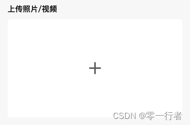

# 获取文件 MD5

本文将介绍如何在小程序中获取上传文件的 `md5` 值。

## 背景

前端通过 OSS 直接上传选择的照片和视频后，在提交时不仅需要上传生成的资源路径，还需要将对应文件的 MD5 值一并传送到后端。



接下来看看具体实现：

## 实现步骤

### 1. 通过 chooseMedia 选择文件

```js
const onUpload = () => {
    wx.chooseMedia({
        count: 1,
        mediaType: ['image', 'video'],
        success: async (res) => {
            const tempFiles = res.temFiles;
            const file = tempFiles[0];
            console.log(file);
        },
        fail: (e) => {
            console.error(e);
        }
    }
}
```

选择文件时，打印的内容如下:

```js
{tempFilePath: "http://tmp/n1OtvNQzNePb324b6402af201f6b45c7a7de4dd15af5.png", size: 76455, fileType: "image"}
```

在小程序中，选择上传文件时返回的是临时路径地址，而不是像 `H5` 中返回的 `File` 对象。 为什么呢？主要跟小程序运行宿主环境、安全性有关。

- **文件系统限制**： 小程序的文件系统与 H5 浏览器不同，它更加封闭和沙盒化。返回临时路径可以更好地管理文件的生命周期，避免文件长时间占用存储空间。
- **平台兼容性**：不同的小程序平台（如微信小程序、支付宝小程序等）需要统一的文件处理方式，而临时路径是一种简单且通用的方案
- **安全性**：直接返回 File 对象可能会带来安全隐患，因为 File 对象可能包含过多的文件信息。使用临时路径可以减少暴露文件细节的风险，提升安全性
- **资源管理**：临时路径便于小程序对文件进行统一管理和清理，防止文件残留影响用户体验和设备性能。

### 2. 通过 getFileInfo 获取文件 MD5 值

getFileInfo 支持摘要算法为 md5、sha1 , 默认为 md5。

#### 2.1 生成 md5

```js
const getMd5 = (templateFile) => {
  return new Promise((resolve, reject) => {
    uni.getFileInfo({
      filePath: templateFile,
      success(res) {
        resolve(res.digest);
      },
      reject(err) {
        reject(err);
      },
    });
  });
};
```

### 3. 完整的代码

```js
const getMd5 = (templateFile) => {
    return new Promise((resolve, reject)=> {
		uni.getFileInfo({
			filePath: templateFile,
			success(res){
				resolve(res.digest);
			},
			reject(err){
				reject(err);
			}
		});
	})
}

const onUpload = () => {
    wx.chooseMedia({
        count: 1,
        mediaType: ['image', 'video'],
        success: async (res) => {
            const tempFiles = res.tempFiles;
            const file = tempFiles[0];
            try {
                const md5 = await getMd5(file.tempFilePath);
                console.log("文件MD5值", md5);
            } catch (error) {
                console.error("获取文件MD5值失败", error);
            }
        },
        fail: (e) => {
            console.error(e);
        }
    }
}
```

## 总结

- 选择文件：使用 `chooseMedia` 方法获取文件。
- 计算 MD5 哈希值：使用 `uni.getFileInfo` 方法获取文件的 `MD5` 值，并返回结果

如果觉得有用，请点赞、转发和评论支持，谢谢！
