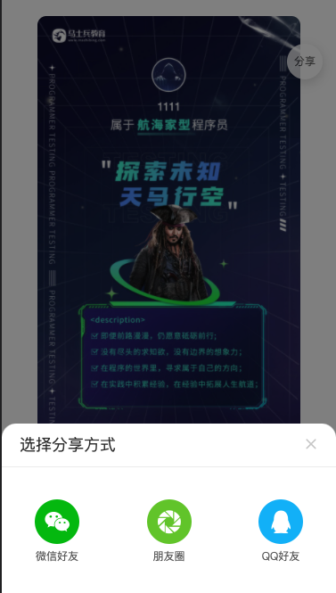
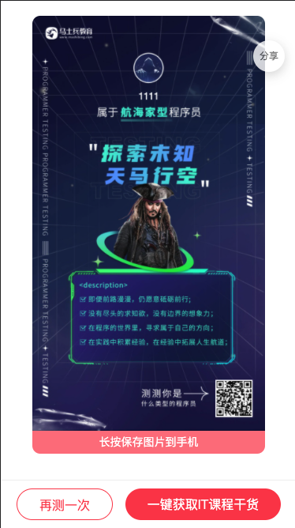

# h5 与 webview 交互

``web-view`` 是一个 web 浏览器组件，可以用来承载网页的容器，会自动铺满整个页面（``nvue`` 使用需要手动指定宽高）.

## 基本使用

```html
<template>
  <web-view src="https://www.baidu.com"></web-view>
</template>
```

``web-view`` 组件详细使用，可以参考官方 [``web-view``](https://uniapp.dcloud.io/component/web-view.html). 在 uniapp 中 ``web-view`` 可设置属性并没详细罗列，需要参考 [``html5plus``](https://www.html5plus.org/doc/zh_cn/webview.html#plus.webview.WebviewStyles)。

下面通过一个实际案例来了解它们的使用。

## 实际案例

在开发 ``51趣味营销`` 活动的时候，活动页是通过单独 ``h5`` 开发的。开发的 ``h5`` 页面需要嵌入到 ``app`` 、``微信``、``公众号`` 中进行营销。

既然需要嵌入到 ``app`` 中，那么就需要使用到 ``web-view`` 组件。

先来说下 ``h5`` 中包含那些需要与 ``app`` 交互的内容，``微信朋友分享``、``微信朋友圈分享``、``一键获取干货``(打开小程序)。




知道内容之后，可以开始探索一下如何完成接入、微信分享、唤醒小程序。

### 3.1 利用 webview 加载 h5

```html
<template>
  <view class="container">
    <web-view @message="message" :src="src"></web-view>
  </view>
</template>

<script>
let wv;
export default {
  data() {
    return {
      src: ''
    }
  },
  onLoad(options){
    this.src = options.src;
    // #ifdef APP-PLUS
    // 此对象相当于 html5plus 里的 plus.webview.currentWebview()。在uni-app里vue页面直接使用plus.webview.currentWebview()无效，非v3编译模式使用this.$mp.page.
    const currentWebview = this.$scope.$getAppWebview() $getAppWebview()
    setTimeout(function() {
      wv = currentWebview.children()[0]
      wv.setStyle({
          scalable: false
      })
    }, 200); //如果是页面初始化调用时，需要延时一下
    // #endif
  }
}
</script>
```

这样基本上，就


### 3.2 引入 uni.webview.js

### 3.3 唤醒微信

## 附录

* [你真的了解 webview 么](https://zhuanlan.zhihu.com/p/58691238)
* [html5plus](https://www.html5plus.org/doc/zh_cn/webview.html#plus.webview.WebviewStyles)
