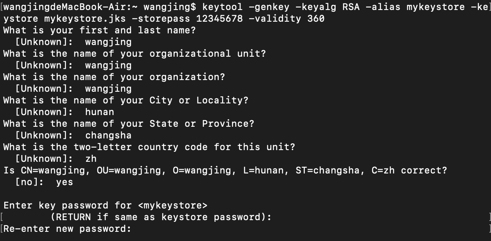
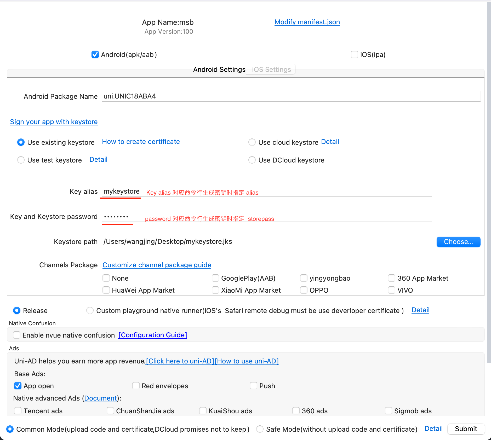

# 生成签名

## 签名是什么

[Android Keystore 漫谈](https://www.jianshu.com/p/644ddb6e3d9c)

## 生成签名

* 通过 JDK
* Android Studio

首先通过 JDK 的方式来生成，大概的步骤的如下

### 安装 JDK

对于 ``Mac`` 用户而言，可以通过 ``Mac`` 的 ``brew`` 来快捷安装。

进入 terminal ，输入如下命令

```shell
brew tap AdoptOpenJDK/openjdk
brew install adoptopenjdk8  // 此处写java8会提示找不到

java // 检测是否安装成功
```

### 借助 Keytool 生成 Keystore

> keytool -genkey -keyalg RSA -alias mykeystore -keystore mykeystore.jks -storepass 12345678 -validity 360

上面每个 keytool 表示:

* -genkey: 此命令用于生成密钥
* -keyalg RSA: 生成密码使用算法
* -alias mykeystore: 产生别名，后面跟别名内容。若未指定，则别名默认为 mykey.
* -keysotre mykeystore.jks : 这表示您正在创建或已经使用的 keystore 的名称。
* storepass : 指定 keystore 密码
* -validity : 指定生成密钥的使用有效期，单位为天

在命令行输入上面命令后，则在控制台依次需要输入如下内容:

* CN：名字或姓氏
* OU：组织单位名称
* O：组织名称
* L：城市或区域名称
* ST：州或省份名称
* C：单位的两字国家代码



这样基本上完成 keystore 的生成，接下来我们可以去 ``HBuilderX`` 中浅尝一下打包。

## Android 签名

进入菜单 ``Menu`` > ``Build`` > 选择 ``MobileApp - Cloud Packaging``。




