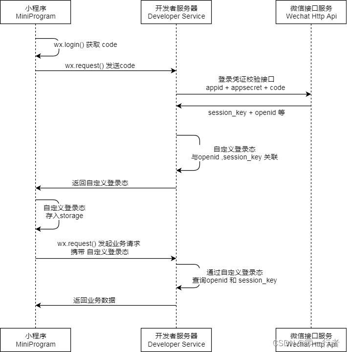
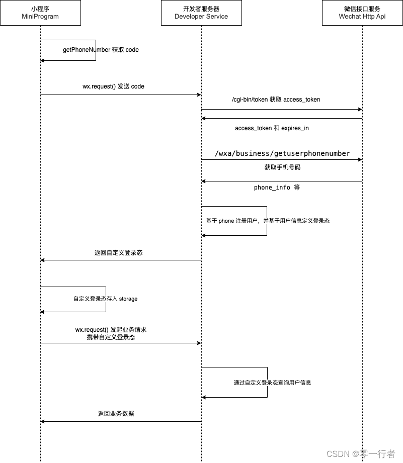

# 登录方式详解

## 1. 小程序登录

小程序有两种登录方式，一种基于手机号码进行登录，另一种是使用用户在公众号下的唯一标识（openid）进行登录(小程序是公众号的一种).

接下来先讲解下，基于 openid 登录。

### 1.1 基于 openid 登录

先看下图，描述通过微信小程序提供的 code 换取当前用户在小程序中的唯一标识，详细流程可以参数下图：



接下来通过代码实现下大概流程:

- 获取 code

```js
uni.login({
  success: async (res) => {
    if (res.errMsg === 'login:ok') {
      const { data } = await login({
        code: res.code,
      });
      // 保存用户信息
    }
  },
  fail(e) {
    uni.showToast({
      title: e.message,
    });
  },
});
```

- 服务端接收 code 去微信后台换取对应 openid

```js
// nodejs 部分代码
const { appid, secret, grant_type } = require('../config/wx');
router.post('/login', (req, res) => {
  const { code } = req.query;
  const { appid, secret, grant_type } = require('../config/wx');
  const { openid } = await request.get('/sns/jscode2session', {
    appid,
    secret,
    js_code: code,
    grant_type,
  });
});
```

- 在数据库中查找对应 openid 是否存在

```js
const { appid, secret, grant_type } = require('../config/wx');
router.post('/login', (req, res) => {
  // 1. 获取 code
  const { code } = req.query;
  // 2. 通过 code 获取 openid 和 session_key
  const { openid } = await request.get('/sns/jscode2session', {
    appid,
    secret,
    js_code: code,
    grant_type,
  });
  // 3. 查找用户是否已经注册
  models.user
    .findOne({
      where: {
        openid,
      },
    })
    .then((user) => {
      if (user) {
        // 3.2 如果用户已经注册，返回用户信息
        res.json(
          new Result({
            data: user,
            msg: '登录成功',
          })
        );
      } else {
        // 3.3 如果用户没有注册，创建用户并返回用户信息
        const username = randomUserName();
        models.user
          .create({
            nickname: username,
            openid,
            avatar: '/uploads/default-avatar.png',
          })
          .then((user) => {
            res.json(
              new Result({
                data: user,
                msg: '登录成功',
              })
            );
          });
      }
    });
});
```

上面就是一个基于 `code` 获取 `openid`，并通过 `openid` 创建新的用户，并将创建好的用户返回。

为了方便理解，这里简化描述了登录逻辑。在实际业务代码中，通常会使用 `openid` 、 `session key` 和用户信息来创建自定义登录凭证（token），并在登录时将用户信息和 `token` 一起返回给前端。前端会将 `token` 存储在本地，并在下一次需要登录的业务请求中携带 `token`，从而实现业务鉴权的功能。这种方式通常使用 `JWT（JSON Web Token）`等工具来实现。在后续的讲解中，我们将详细介绍这些概念和技术细节。

### 1.2 手机号码快捷登录

获取手机号码的前提：

- 非个人小程序
- 认证的小程序
- 非海外的企业认证

下面是大概业务流程图：



#### 1.2.1 获取对应 code

```vue
<template>
  <button
    class="login-btn"
    open-type="getPhoneNumber"
    @getphonenumber="getPhoneNumber"
  >
    手机号码登录
  </button>
</template>

<script>
export default {
  setup() {
    // 目前该接口针对非个人开发者，且完成了认证的小程序开放（不包含海外主体）
    const getPhoneNumber = (e) => {
      const { code, errMsg } = e.detail;
      if (errMsg === 'getPhoneNumber:ok') {
        const { data } = await loginByPhone({
          code,
        });
      } else {
        uni.showToast({
          title: errMsg,
        });
      }
    };

    return {
      getPhoneNumber,
    };
  },
};
</script>
```

#### 1.2.2 后端处理逻辑

```js
// 基于手机号登录
router.post('/loginByPhone', async function (req, res) {
  try {
    // 1. 获取 code 和 loginCode
    const { code } = req.body;
    // 2. 获取接口调用凭据，理论上这里需要缓存 access_token，避免频繁调用接口
    const { access_token } = await request.get('/cgi-bin/token', {
      grant_type: 'client_credential',
      appid,
      secret,
    });
    // 3. 获取手机号
    const { phone_info } = await request.post(
      `/wxa/business/getuserphonenumber?access_token=${access_token}`,
      {
        code,
      }
    );
    // 4. 查找用户是否已经注册
    // 4.1 根据 phone 查找用户
    const { purePhoneNumber } = phone_info;
    models.user
      .findOne({
        where: {
          purePhoneNumber,
        },
      })
      .then((user) => {
        if (user) {
          // 4.2 如果用户已经注册，返回用户信息
          res.json(
            new Result({
              data: user,
              msg: '登录成功',
            })
          );
        } else {
          // 4.3 如果用户没有注册，创建用户并返回用户信息
          const username = randomUserName();
          models.user
            .create({
              nickname: username,
              avatar: '/uploads/default-avatar.png',
              phone: phone_info.purePhoneNumber,
            })
            .then((user) => {
              res.json(
                new Result({
                  data: user,
                  msg: '登录成功',
                })
              );
            });
        }
      });
  } catch (error) {
    res.json(
      new Result({
        code: 'BIZ_ERROR',
        msg: error.errmsg || error.message,
      })
    );
  }
});
```

上面代码，实现获取手机号码并使用手机号码作为唯一标识，进行用户创建和查找的操作。

从登录的角度来看，使用手机号码作为唯一标识符是没有问题的。然而，如果用户尝试使用非手机号码（例如 `OpenID`）进行登录，并在数据库中找不到匹配的记录时，系统会创建一个新的账号。这可能导致同一个用户在系统中存在多个账号的情况。

为了优化这种情况，可以考虑以下几种方法：

- 当用户使用 `openid` 登录后，检测未绑定手机号码时，进行号码绑定
- 当用户使用手机号码登录时，提前调用 `wx.login` 获取对应 `code`，换取 `openid` 把他与手机号码进行关联

现在基于上面的代码，采用第二种方案，只需要微调下代码就能解决这个问题。

- 登录时把 `wx.login` 获取 `code` 传递给后端

```vue
<template>
  <button
    class="login-btn"
    open-type="getPhoneNumber"
    @getphonenumber="getPhoneNumber"
  >
    手机号码登录
  </button>
</template>

<script>
export default {
  setup() {
    // 目前该接口针对非个人开发者，且完成了认证的小程序开放（不包含海外主体）
    const getPhoneNumber = (e) => {
      const { code, errMsg } = e.detail;
      if (errMsg === 'getPhoneNumber:ok') {
        uni.login({
          success: async (res) => {
            if (res.errMsg === 'login:ok') {
              const { data } = await loginByPhone({
                code,
                loginCode: res.code,
              });
              userStore.setUserInfo(data);
              uni.navigateBack();
            }
          },
          fail(e) {
            uni.showToast({
              title: e.message,
            });
          },
        });
      } else {
        uni.showToast({
          title: errMsg,
        });
      }
    };

    return {
      getPhoneNumber,
    };
  },
};
</script>
```

- 服务端基于 loginCode 换取 openid

```js
// 基于手机号登录
router.post('/loginByPhone', async function (req, res) {
  try {
    // 1. 获取 code 和 loginCode
    const { code, loginCode } = req.body;

    // 2. 获取接口调用凭据，理论上这里需要缓存 access_token，避免频繁调用接口
    const { access_token } = await request.get('/cgi-bin/token', {
      grant_type: 'client_credential',
      appid,
      secret,
    });

    // 3. 获取 openid
    const { openid } = await request.get('/sns/jscode2session', {
      appid,
      secret,
      js_code: loginCode,
      grant_type,
    });

    // 4. 获取手机号
    const { phone_info } = await request.post(
      `/wxa/business/getuserphonenumber?access_token=${access_token}`,
      {
        code,
        openid,
      }
    );

    // 5. 查找用户是否已经注册
    // 5.1 根据 openid 查找用户
    models.user
      .findOne({
        where: {
          openid,
        },
      })
      .then((user) => {
        if (user) {
          // 5.2 如果用户已经注册，返回用户信息
          res.json(
            new Result({
              data: user,
              msg: '登录成功',
            })
          );
        } else {
          // 5.3 如果用户没有注册，创建用户并返回用户信息
          const username = randomUserName();
          models.user
            .create({
              nickname: username,
              openid,
              avatar: '/uploads/default-avatar.png',
              phone: phone_info.purePhoneNumber,
            })
            .then((user) => {
              res.json(
                new Result({
                  data: user,
                  msg: '登录成功',
                })
              );
            });
        }
      });
  } catch (error) {
    res.json(
      new Result({
        code: 'BIZ_ERROR',
        msg: error.errmsg || error.message,
      })
    );
  }
});
```

这种方案被视为最佳的解决方案，能够有效解决多账号和绑定手机号码等问题。 实际上，采用哪种方式取决于具体的业务场景，因为在某些情况下，用户可能会担心手机号码泄露而不愿采用这种方式。

#### 1.2.3 注意

- 获取手机号码是需要收费，每次调用需要 `0.03` 元。
- `wx.login` 与 `getPhoneNumber` 中获取的 `code` 不是同一个

## 总结

- 基于 openid 或 手机号码快捷登录
- 获取手机号码前置条件
- 如何解决多账号的问题
- 讲解前端、后端、微信登录过程中完整交互流程，方便更好去理解小程序登录

**如果您有任何疑问，请随时在评论区留言。**
