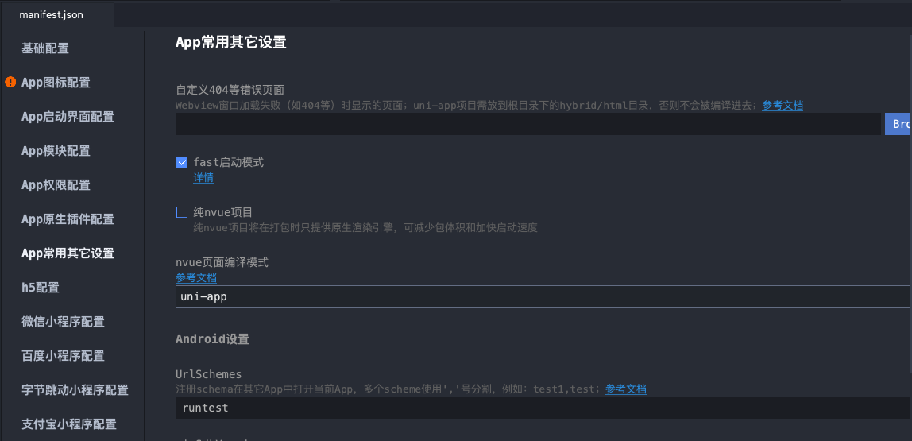

# H5 打开 APP 并跳转具体页面

要想打开一个 APP 并跳转具体页面 ，大概准备如下:

* 配置 APP 的 URL Scheme
* H5 与 APP 约定参数传递方式，APP 侧在应用的入口根据参数格式解析参数
* APP 根据参数跳转到相应的页面


## 配置 URL Scheme

打开 ``manifest.json`` ，找到 ``APP常用其它配置选项``， 找到对应的 ``UrlSchemes``。



从 ``UrlSchemes`` 可以知道，它支持为应用配置多个 Scheme 。


## 应用解析参数

```js
  // App.vue
  /**
	* 解析启动参数
	* 约定参数格式
	* runtest://?page=qsdetail&questionId=${this.questionId}
	*/
	function parseLaunchParams(){
		//#ifdef APP-PLUS

      // IOS 需要添加延迟，否则 plus.runtime.arguments 永远访问到的是上一次值。
			setTimeout(() => {
				const regx = /^runtest:\/\/\?/;
				if(plus.runtime.arguments && regx.test(plus.runtime.arguments)){
					const queryString = plus.runtime.arguments.split(regx)[1];
					const query = qs.parse(queryString);
          // 根据页面参数跳转到不同的页面。
					if(query.page === 'qsdetail'){
						setTimeout(()=> {
							router.push({
								name: 'qsdetail',
								params: {
									id: query.questionId
								}
							});
						}, 500)
					}
          // 这里清空目的，防止参数多次服用。
					plus.runtime.arguments = null;
					plus.runtime.arguments = '';
				}
			})
		//#endif
	}

  export default {
    ...,
    onShow(){
      //#ifdef APP-PLUS
				parseLaunchParams();
			//#endif
    },
    ...
  }
```

## H5 跳转

```js
<a href="runtest://?page=qsdetail">openApp</a>
```

## 在未安装应用时跳转到下载页

理想情况用户都安装 APP，在很多时候我们并不知道用户是否已经安装某个应用，当未成功跳转时，则跳转至下载页面。

针对上面的方式做下调整，把跳转逻辑换成事件处理的方式。

```js

  // app 下载器
	let appDownload;
  // 通用协议地址
  let commSchemeUrl = "runtest://?page=qsdetail";
  // iOS 下载地址
  let iOSDownloadUrl = "https://itunes.apple.com/cn/app/";
  // Android 下载地址
  let androidDownloadUrl = "Android 下载地址"

  function openApp() {
    let u = navigator.userAgent;
    let isAndroid = u.indexOf('Android') > -1 || u.indexOf('Adr') > -1; //判断是否是 android终端
    let isIOS = !!u.match(/\(i[^;]+;( U;)? CPU.+Mac OS X/); //判断是否是 iOS终端
    // 首次尝试打开 App 并跳转
    if (isAndroid || isIOS) {
      window.location.href = commSchemeUrl;
    }
    // 3ms 后没打开，直接跳转对应下载页面
    appDownload = setTimeout(function() {
      if (isAndroid) {
        window.location.href = androidDownloadUrl;
      } else if (isIOS) {
        window.location.href = iOSDownloadUrl;
      }
    }, 3000);
  }

  document.addEventListener('visibilitychange webkitvisibilitychange', function() {
    // 如果页面隐藏，认为打开 app，清除下载任务
    if (document.hidden || document.webkitHidden) {
      clearTimeout(appDownload)
    }
  })
  window.addEventListener('pagehide', function() {
    clearTimeout(appDownload)
  })
```

## 问题

* IOS 下 ``plus.runtime.arguments`` 不能获取到 URL Scheme 协议参数

> 检查 pages.json 中是不是有 condition 这个节点(非常重要)

* IOS 下 ``plus.runtime.arguments`` 获取到的都是上一次的值

> 需要通过 setTimeout 来解决，代码如下

```js
onShow() {
  setTimeout(function(){
      console.log(plus.runtime.arguments)
      console.log(plus.runtime.launcher)
  },0);
}
```

## 参考文档

* [plus.runtime.arguments](https://www.html5plus.org/doc/zh_cn/runtime.html#plus.runtime.arguments)
* [iOS 平台设置 UrlSchemes，实现被第三方应用调用](https://ask.dcloud.net.cn/article/id-64__page-2)
* [Android平台设置UrlSchemes，实现被第三方应用调用](https://ask.dcloud.net.cn/article/409)
* [IOS下plus.runtime.arguments不能获取到URL Scheme协议参数](https://ask.dcloud.net.cn/question/95040)
