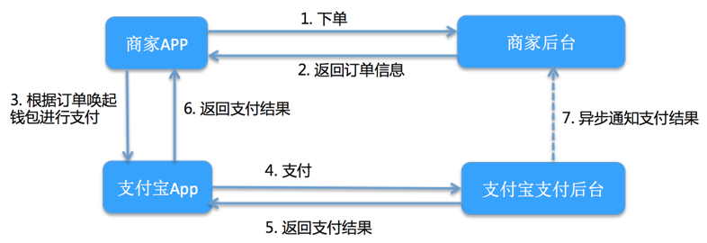

# 支付功能

接入支付应该很常见的业务需求，本篇文章将把常见支付渠道流程进行梳理并实现。

在 `uniapp` 中要实现支付还是简单，目前他提供两种模式:

- requestPayment + 服务端开发(自定义)
- requestPayment + uniCloud(云服务) + uniPay

不管 `自定义`、`uniCloud` 的作用都是对接第三方的平台。 只不过使用 uniCloud 服务，可以直接使用 uniPay 工具，它封装对第三方支付的服务。可以大大提高支付业务的开发效率。这也是官方推荐使用的方式。

目前常用支付方式有：`微信`、`支付宝`、`苹果支付`。 这也是 `uniapp` 中 `Payment Plugin` 提供支持的几种方式。

虽然 `uniapp` 提供开箱即用的 [`uni.requestPayment`](https://uniapp.dcloud.io/api/plugins/payment.html#requestpayment) API 供我们在不同客户的调用支付，但是了解每种支付的流程也是很有必要的，这样可以更好的使用和排查问题。

接下来一一分析各个支付流程。

## 支付宝

### 支付宝订单详细结构图


### 客户端大概交互流程



在流程熟悉后，现基于 `uniapp` 提供的 `Payment` 插件， 使用提供 [`uni.requestPayment(OBJECT)`](https://uniapp.dcloud.io/api/plugins/payment.html#requestpayment) 来完成支付功能。

在使用 `API` 之前，需要做一些配置工作。 在 `manifest.json` 中添加配置

在可视化配置界面中勾选 ☑️ Payment(支付)，如下：


勾选之后，源码视图中可以看到如下：

```json
 "payment" : {
      "alipay" : {
          "__platform__" : [ "ios", "android" ]
      }
  },
```

此时表示配置成功了，接下来进入到实际的业务代码编写。
