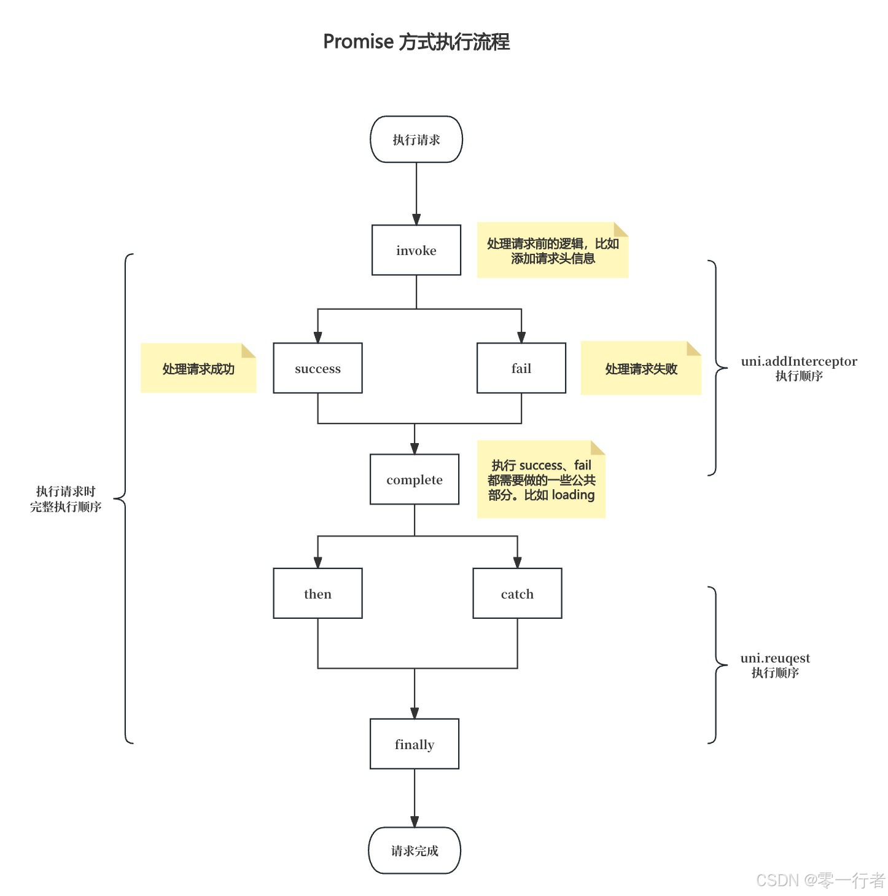
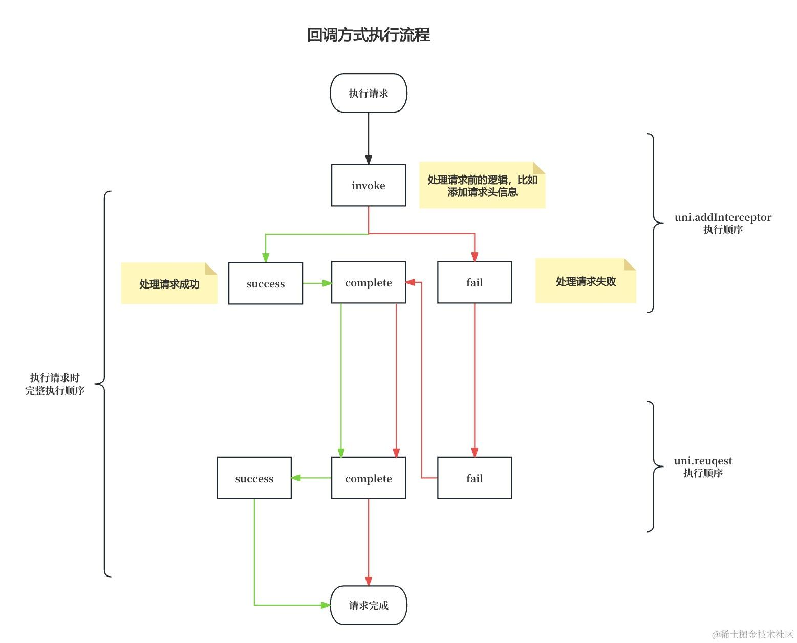

# 请求库

## 背景

在前端开发中，HTTP 请求是与服务器进行数据交互的核心手段。无论是获取数据还是提交数据，前端应用几乎都离不开 HTTP 请求。在 uniapp 中，`uni.request` 是官方提供的用于发起 HTTP 请求的基础 API。然而，直接使用 `uni.request` 存在一些问题和不足，比如：

1. **代码冗余**：每次发起请求时都需要编写类似的配置代码，导致代码重复。
2. **缺乏统一管理**：没有统一的地方管理请求参数、头信息、错误处理等，使得代码不易维护

## 意义

- **简化请求配置**：在每次发起请求时，通常需要配置很多参数，比如 URL、请求头、请求体等。通过封装请求库，可以设置默认的请求参数，简化每次请求的配置操作，减少开发人员的工作量，提高开发效率。
- **管理请求凭证**：通过封装请求库，可以集中管理凭证，确保每次请求都自动携带正确的凭证。
- **便于维护和扩展**：封装请求库后，如果需要对请求逻辑进行修改或扩展，只需要在封装库中进行调整，而不需要在项目的各个地方逐一修改。此外，如果需要将请求库更换为其他库（例如 Axios），只需修改封装的请求库部分，而无需改动业务代码。
- **提高用户体验**：通过统一处理全局请求 `Loading` 状态，可以在请求进行中显示加载提示，提升用户体验。

## 实现思路

### 1. 把 uni.request 改为支持 Promise 调用方式

将 `uni.request` 改为支持 `Promise` 调用方式的好处是可以避免回调嵌套问题，并且可以借助 `async/await` 实现同步调用。

实现方式大概有如下两种：

#### 1.1 通过 uni 自身提供的方法

调用 `uni.request` 时，如果不传入 `success`、`fail`、`complete` 回调函数，`uni.request` 的返回值将是一个 `Promise` 对象。

```js
uni
  .request({
    url: '',
    // ... 其他配置
  })
  .then(() => {})
  .catch(() => {})
  .finally(() => {});
```

#### 1.2 通过 Promise 包装

```js
new Promise((resolve, reject) => {
  uni.request({
    url: '',
    success(res) {
      resolve(res);
    },
    fail(error) {
      reject(error);
    },
    complete() {},
  });
});
```

具体采用哪种方式都可以，这里选择第一种。

### 2. 定义默认请求参数

在请求时，通常需要设置 `content-type`、`timeout` 等信息。这些参数通常不会改变，因此可以设计为默认参数，同时保留外部覆盖默认参数值的能力。

#### 2.1 定义默认参数

```js
// 定义默认参数
const defaultOptions = {
  timeout: 15000,
  dataType: 'json',
  header: {
    'content-type': 'application/json',
  },
};
```

#### 2.2 合并外部参数与默认参数

提供外部覆盖默认参数值的能力

```js
const defaultConfig = {
  timeout: 15000,
  dataType: 'json',
  header: {
    'content-type': 'application/json',
  },
};
const wrapRequest = ({
  url = '',
  data = {},
  method = 'GET',
  header = {},
} = {}) => {
  return uni.request({
    ...defaultConfig,
    url,
    data,
    method,
    header: {
      ...defaultOptions.header,
      ...header,
    },
  });
};
```

### 3. 统一处理请求凭证

在大多数系统中，接口请求通常需要传递用户凭证。通常的做法是在请求的 `Header` 中添加 `Authorization` 属性。为了简化这个过程，可以通过拦截器来实现。

```js
const TOKEN_KEY = 'token';

// 处理 token
const handleToken = (config) => {
  const token = uni.getStorageSync(TOKEN_KEY);
  if (token) {
    config.header.Authorization = token;
  }
};
uni.addInterceptor('request', {
  invoke: function (config) {
    handleToken(config);
  },
});
```

另外，系统通常会有多个环境。在这种情况下，可以根据不同的环境设置不同的 `BASE_URL`，这也可以通过拦截器来实现。

```js
const BASE_URL = '';

const handleURL = (config) => {
  const { url } = config;
  if (!/https|http/.test(url)) {
    config.url = url.startsWith('/')
      ? `${BASE_URL}${url}`
      : `${BASE_URL}/${url}`;
  }
};

uni.addInterceptor('request', {
  invoke: function (config) {
    handleURL(config);
  },
});
```

如果有其他处理需求，可以直接在这里添加。

### 4. 统一处理公共响应状态码

为了避免在多个地方处理公共的错误逻辑，例如凭证无效时跳转到登录页、移除本地 token 等，我们可以在全局请求响应拦截器中集中处理这些问题。

```js
const LOGIN_INVALID_CODE_LIST = ['INVALID_TOKEN', 'EXPIRED_TOKEN'];
const SUCCESS = 'SUCCESS';

uni.addInterceptor('request', {
  success(res) {
    const { data: resData } = res;
    const { code, message } = resData;
    if (code !== SUCCESS) {
      // 如果响应代码在登录无效代码列表中
      if (LOGIN_INVALID_CODE_LIST.includes(code)) {
        uni.showToast({
          title: message,
          icon: 'none',
        });
        uni.navigateTo({
          url: '/pages/login/login',
        });
        return;
      } else {
        // 处理其他错误代码
        return Promise.reject(resData);
      }
    }
    return Promise.resolve(resData);
  },
});
```

### 5. 封装公共方法 GET、POST、DEL、PUT

为了进一步简化请求参数，可以提供一系列方法，例如 `GET`、`POST`、`DELETE`、`PUT`。

```js
export const get = (params) => wrapRequest({ ...params, method: 'GET' });
export const post = (params) => wrapRequest({ ...params, method: 'POST' });
export const put = (params) => wrapRequest({ ...params, method: 'PUT' });
export const del = (params) => wrapRequest({ ...params, method: 'DELETE' });
```

这样做的好处，它消除了每次调用时显式传入 `HTTP` 方法的需要，使代码更简洁、更易读。这样做的好处是你在调用这些方法时只需关注请求参数，而不需要重复指定 `HTTP` 方法。

### 6. 定义全局请求 Loading

在正常情况下，我们的接口通常会很快完成。然而，考虑到不同网络状况下，接口响应速度可能会变慢，从而增加用户的等待时间。为了优化用户体验，我们可以在全局请求中添加 `Loading` 提示，这将大大提升用户体验。

```js
const showLoading = () => {
  uni.showLoading({
    title: '加载中',
  });
};

const hideLoading = () => {
  uni.hideLoading();
};

uni.addInterceptor('request', {
  invoke: function (request) {
    showLoading();
    return request;
  },
  complete() {
    hideLoading();
  },
});
```

这样每个接口请求时都会触发显示 `Loading`。考虑到某些接口可能不需要显示 `Loading`，我们可以允许用户在定义接口时明确控制是否展示 `Loading`。

```js
const showLoading = (loading) => {
  uni.showLoading({
    title: '加载中',
  });
};

const hideLoading = (loading) => {
  uni.hideLoading();
};

uni.addInterceptor('request', {
  invoke: function (config) {
    if (config.loading) {
      showLoading();
    }
    return request;
  },
  complete() {
    hideLoading();
  },
});

const wrapRequest = ({
  url = '',
  data = {},
  method = 'GET',
  header = {},
  loading = true, // 默认是展示 loading
} = {}) => {
  return uni.request({
    ...defaultConfig,
    url,
    data,
    method,
    loading,
    header: {
      ...defaultOptions.header,
      ...header,
    },
  });
};
```

为了解决接口请求很快时 `Loading` 闪烁的问题，我们可以添加一个延迟参数。如果请求时间超过 `50ms`(具体阀值可以自己去定义) 才显示 `Loading`，否则就不展示：

```js
const LOADING_DELAY = 50; // 50ms 延迟
let loadingTimer;

const showLoading = () => {
  uni.showLoading({
    title: '加载中',
  });
};

const hideLoading = () => {
  uni.hideLoading();
};

uni.addInterceptor('request', {
  invoke: function (config) {
    if (config.loading) {
      loadingTimer = setTimeout(showLoading, LOADING_DELAY);
    }
    return config;
  },
  complete() {
    clearTimeout(loadingTimer);
    hideLoading();
  },
});
```

## 7. 完整代码如下

```js
const defaultOptions = {
  timeout: 15000,
  dataType: 'json',
  header: {
    'content-type': 'application/json',
  },
};
const TOKEN_KEY = 'token';
const BASE_URL = '';
const LOGIN_INVALID_CODE_LIST = ['INVALID_TOKEN', 'EXPIRED_TOKEN'];
const SUCCESS = 'SUCCESS';
const LOADING_DELAY = 50; // 50ms 延迟
let loadingTimer;

const handleURL = (config) => {
  const { url } = config;
  if (!/https|http/.test(url)) {
    config.url = url.startsWith('/')
      ? `${BASE_URL}${url}`
      : `${BASE_URL}/${url}`;
  }
};

const handleToken = (config) => {
  const token = uni.getStorageSync(TOKEN_KEY);
  if (token) {
    config.header.Authorization = token;
  }
};

const showLoading = () => {
  uni.showLoading({
    title: '加载中',
  });
};

const hideLoading = () => {
  uni.hideLoading();
};

uni.addInterceptor('request', {
  invoke: function (config) {
    if (config.loading) {
      loadingTimer = setTimeout(showLoading, LOADING_DELAY);
    }
    handleURL(config);
    handleToken(config);
  },
  success(res) {
    const { data: resData } = res;
    const { code, message } = resData;
    if (code !== SUCCESS) {
      // 如果响应代码在登录无效代码列表中
      if (LOGIN_INVALID_CODE_LIST.includes(code)) {
        uni.showToast({
          title: message,
          icon: 'none',
        });
        uni.navigateTo({
          url: '/pages/login/login',
        });
        return;
      } else {
        // 处理其他错误代码
        return Promise.reject(resData);
      }
    }
    return Promise.resolve(resData);
  },
  complete() {
    clearTimeout(loadingTimer);
    hideLoading();
  },
});

const wrapRequest = ({
  url = '',
  data = {},
  method = 'GET',
  header = {},
  loading = true,
} = {}) => {
  return uni.request({
    ...defaultOptions,
    url,
    data,
    method,
    loading,
    header: {
      ...defaultOptions.header,
      ...header,
    },
  });
};

export const get = (params) => wrapRequest({ ...params, method: 'GET' });
export const post = (params) => wrapRequest({ ...params, method: 'POST' });
export const put = (params) => wrapRequest({ ...params, method: 'PUT' });
export const del = (params) => wrapRequest({ ...params, method: 'DELETE' });
```

## 8. 测试

```js
import { get } from '@/utils/request';

get({
  url: 'https://api.aigcway.com/aigc/chat-category/list',
}).then((res) => {
  console.log(res);
});
```

输出如下:

```js
{
    "code": "SUCCESS",
    "message": "操作成功",
    "data": []
}
```

## 总结

我们完成了一个通用请求库的封装，这基本上可以满足大多数业务需求。在具体请求中，状态码处理可以根据自身业务需求进行调整。

为了掌握上面的内容，需要掌握 `uni.addInterceptor`、`uni.request ` 执行的完整流程。以下是整理的不同情况下的流程图，可以参考学习。



上面流程图对应示例代码：

```js
uni.addInterceptor('request', {
  invoke: function (config) {
    console.log('interceptor invoke');
  },
  success(res) {
    console.log('interceptor success');
  },
  complete() {
    console.log('interceptor complete');
  },
});
uni
  .request({
    url: '',
  })
  .then(() => {
    console.log('then');
  })
  .catch(() => {
    console.log('catch');
  })
  .finally(() => {
    console.log('finally');
  });
```



上面流程图对应示例代码：

```js
uni.addInterceptor('request', {
  invoke: function (config) {
    console.log('interceptor invoke');
  },
  success(res) {
    console.log('interceptor success');
  },
  complete() {
    console.log('interceptor complete');
  },
});
uni.request({
  success() {
    console.log('success');
  },
  fail() {
    console.log('fail');
  },
  complete() {
    console.log('complete');
  },
});
```

如果大家觉得有帮助，请点赞、收藏、分享，谢谢！
